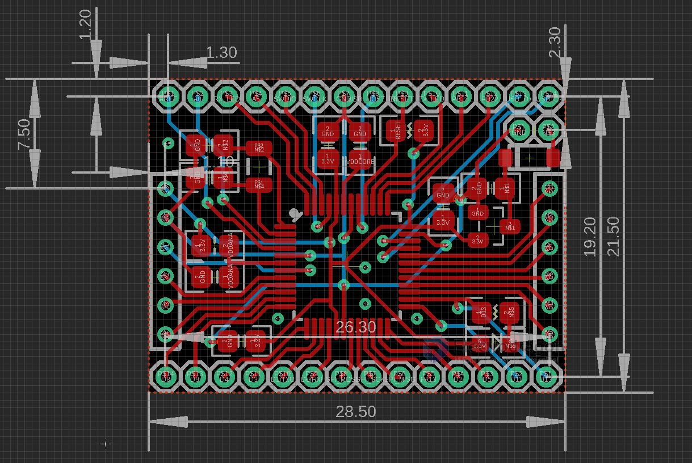
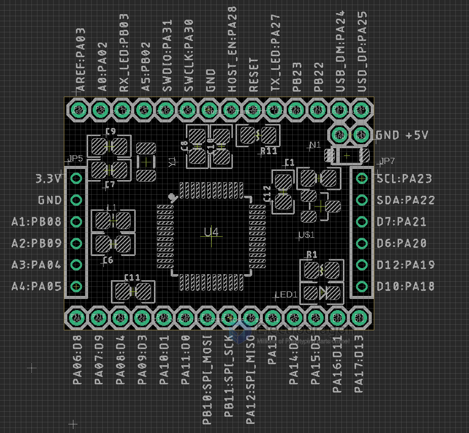

# DOD1107 dat 

https://www.electrodragon.com/product/samd21-ultra-mini-development-board-arm-cortex-m0-32-bit/

## Dimension 

## Pin Definitions and arduino mapping 

## Programming：
- On board programming USB pin port, on top right corner: D+, D-, GND, +5V pin port.
- You need a USB-to-pin header cable to connect from USB to these pins. Please prepare this alone.
- Firmware: (Default) Currently preloaded with arduino bootloader, you can attach USB cable and use with arduino core out of box.