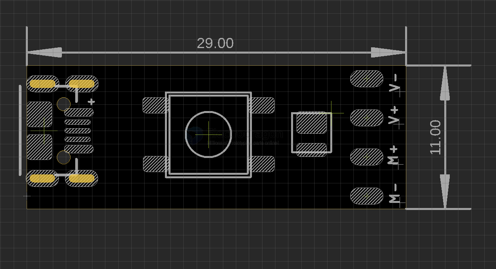
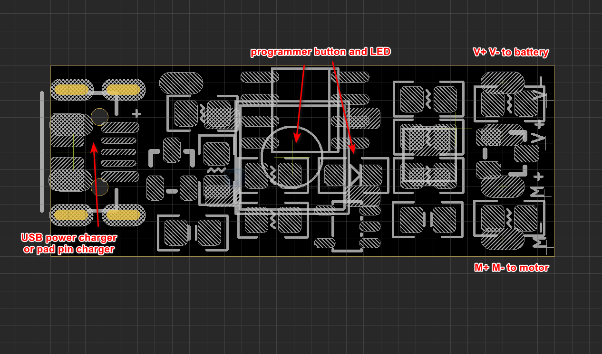
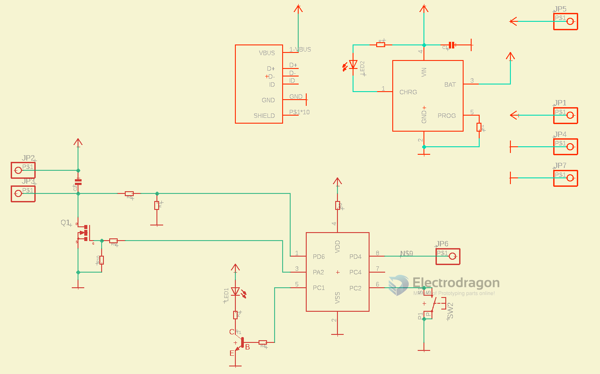

# DOD1119-dat mini-toy-board-dat

## Board map 

## Functions 

## SCH 

- PD6/PA1 - motor control 
- PC1 - led control 
- PC2 - button input 
- PD1/PD4/PD5 = pin 8 = SWIO 

## demo 

- https://www.youtube.com/watch?v=v3h-EoI-HIQ

## ref 

- [[CH32V003-dat]]

- [[mosfet-dat]] - [[battery-charge-dat]]