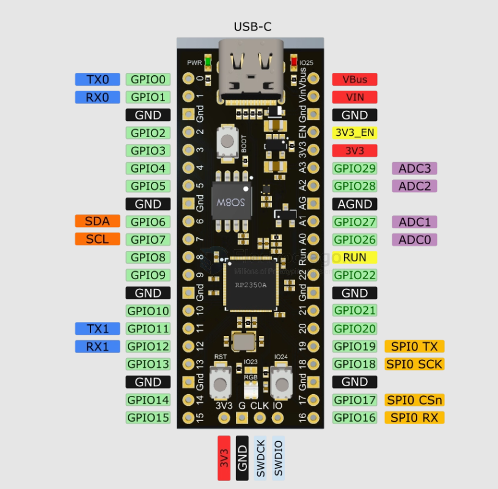
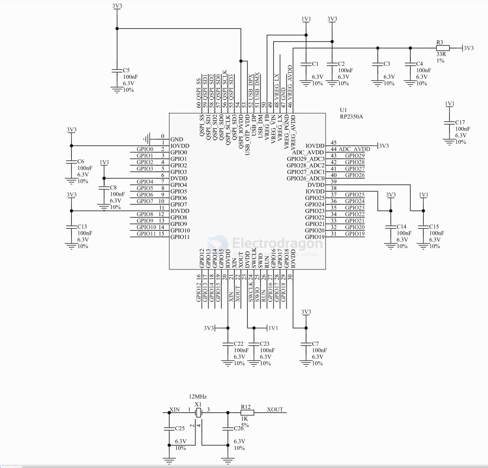
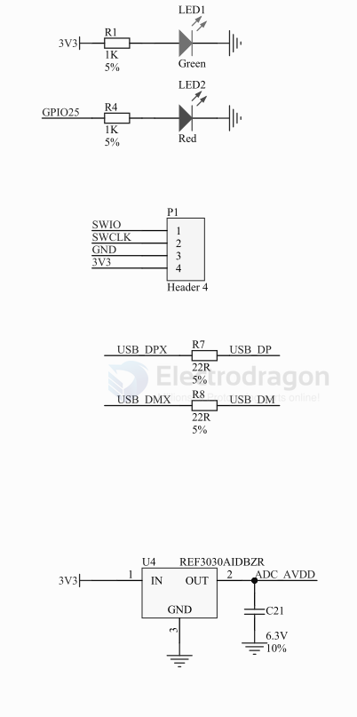

# DOD1123-dat

- [[RP2350-dat]]

- [[RP2040-dat]]

## board map 

## RP2350A Board Specifications

Main features include:

- **Dual Cortex-M33 or Hazard3 processors, up to 150MHz**
- 520KB multi-bank high-performance SRAM
- Supports up to 16MB external flash via dedicated QSPI bus
- DMA controller
- Fully connected AHB crossbar switch
- On-chip programmable LDO for core voltage generation
- 2 on-chip PLLs for generating USB and core clocks
- 30 GPIO pins, 4 of which can be used as analog inputs
- 2 UARTs
- 2 SPI controllers
- 2 I2C controllers
- 24 PWM channels
- USB 1.1 controller and PHY, supporting host and device modes
- 3 Programmable IO (PIO) blocks, with a total of 12 state machines

| Parameter               | Value / Description                                         |
| ----------------------- | ----------------------------------------------------------- |
| Model                   | Pico2                                                       |
| Chip Model              | RP2350A                                                     |
| Core Architecture       | Dual-core Cortex-M33 or RISC-V, Hazard3 processors          |
| Main Frequency          | 150 MHz                                                     |
| On-chip SRAM            | 520 kB                                                      |
| On-board QSPI Flash     | Upgraded to 16 MB, with added RGB LED                       |
| GPIO                    | 26 pins (3 can be used as ADC)                              |
| Programmable IO (PIO)   | 3 IO (PIO) blocks, 12 state machines total                           |
| UART                    | 2                                                           |
| SPI Controllers         | 2                                                           |
| I2C Controllers         | 2                                                           |
| PWM Channels            | 16                                                          |
| USB                     | 1× USB 1.1 controller and PHY, with host and device support |
| USB Port Type           | Type-C                                                      |
| Power Supply            | USB 5V, VSYS 1.8V–5.5V                                      |
| Supply Voltage          | 5V                                                          |
| Output Voltage          | 5V / 3.3V                                                   |
| GPIO Voltage            | 3.3V                                                        |
| Operating Current       | ≤ 300 mA                                                    |
| Pin Count               | 40                                                          |
| ADC Resolution          | 12-bit, 500 KSPS                                            |
| Operating Temperature   | -20°C to 85°C                                               |
| Supported Languages     | MicroPython, C, C++                                         |
| Programming Method      | Recognized as mass storage device, drag-and-drop upload     |
| Development Environment | Visual Studio Code, Eclipse                                 |

## SCH 

core chip 

- [[flash-dat]] - [[LDO-dat]]

- button GPIO24 and RUN 

- [[WS2812-dat]] at GPIO23 

- [[voltage-reference-dat]]

## ref 

- [[MCU-dat]]

- [[peripherals-dat]]