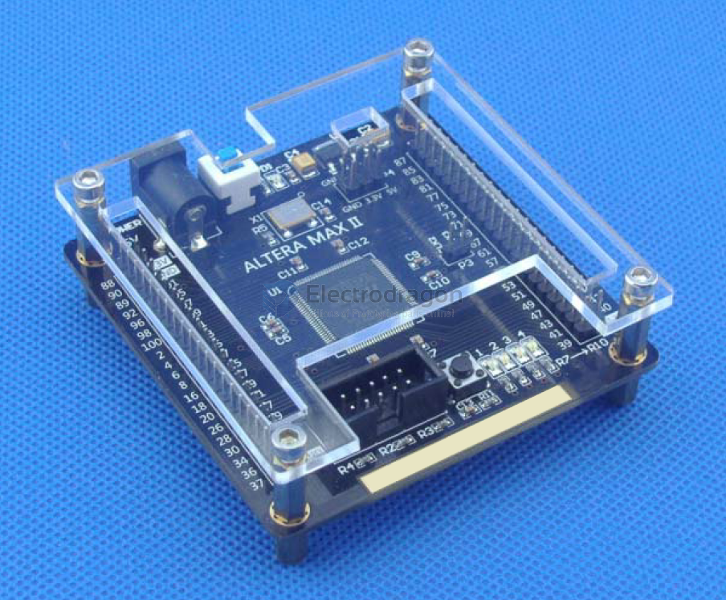
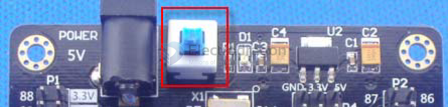

# DODS044 dat 

https://www.electrodragon.com/product/altera-cpld-epm240-epm570-dev-board/

## Board Look 

## EPM570 vs. EPM240 

PCB supports two chips at the same time: EPM240T100C5N and EPM570T100C5N.

The two are the same in terms of package, but have 4 different pin definitions:
- PIN37, 39, 88, and 90 of EPM240T100C5N are used as IO.
- PIN37 and 90 of EPM570T100C5N must be connected to GND; PIN39 and 88 must be connected to 3.3V.

Therefore, if the board you purchased is EPM570T100C5N, the board should have 4 short-circuit jumpers, which must be brought in and cannot be removed, otherwise the circuit will not work properly.

## power supply 

The development board is powered by 5V input. We recommend purchasing a standard 5V/2A power supply from our store, with positive inside and negative outside. 

If you use other power supplies, please make sure the output voltage is 5V to avoid damage to the development board due to voltage differences!

## Clock 

- (i) CLK0 is used as the system working clock and is directly connected to a 50MHz crystal oscillator; 
- (ii) CLK1 is used as a reserved clock; 
- (iii) CKL2 and CLK3 are user input pins, which are brought out with pin headers for user use; 
- PIN44 occupied by reset can be used not only for reset but also as an independent button. Please use it flexibly.

## schematic 

- please reply to the order email to get 

## ref 

- [[EPM570-dat]] - [[DODS044]] - [[DODS044-dat]]

- [[CPLD-dat]] - [[FPGA-dat]]