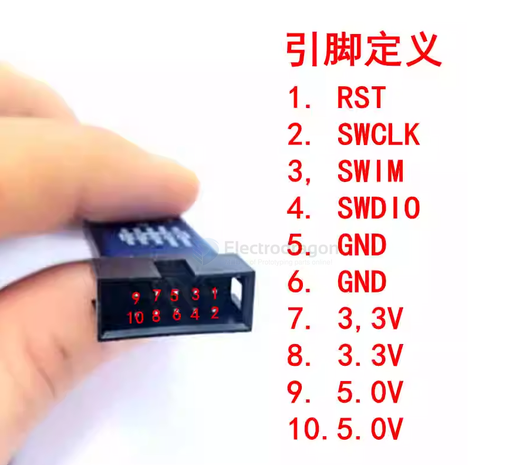

# DPR1004-dat

- [[st-link-dat]]

https://www.electrodragon.com/product/st-link-v2-programmer-for-stm8-stm32/

## Pin map 

## Supported Software List 

The supported software versions are as follows:

- ① XTW LINK ST Utility 2.0 and above
- ② STVD 4.2.1 and above
- ③ STVP 3.2.3 and above
- ④ IAR EWARM V6.20 and above
- ⑤ IAR EWSTM8 V1.30 and above
- ⑥ KEIL RVMDK V4.21 and above

## ref 

- [[DPR1004]] 

- [[stm32-dat]]

- legacy wiki page - https://w.electrodragon.com/w/ST-Link