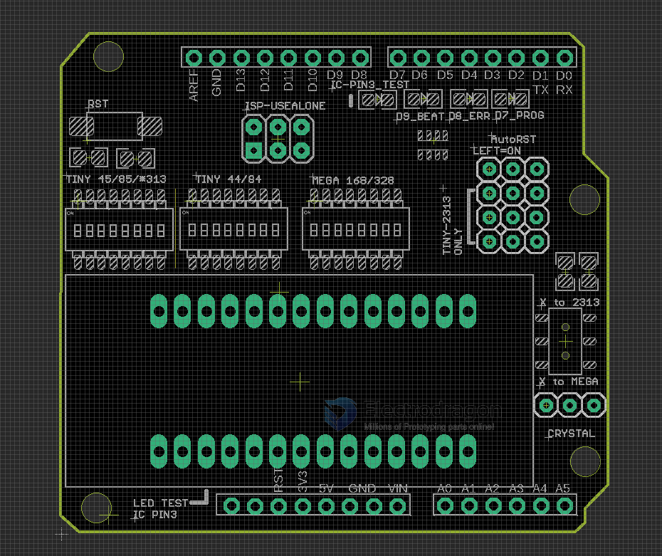

# DPR1009 dat

- [legacy wiki page](https://w.electrodragon.com/w/AVR_PROG_Shield)
- please refer for any missing info on legacy wiki

## Board Map and Versions

## Use guide

- Double check if cyrstal is place on the 3-pin position, check if auto-reset is place on ON.
- For each type of ICs, please configure wiring:
  - For Attiny 44, etc, turn all left switch position ON, the rest switches OFF, and jumper for 2313 OFF, no need crystal usually
  - for Attiny232, etc, turn all middle switch position ON, the rest switches OFF, and jumper for 2313 ON, switch crystal switch to top
  - For Atmega 328, etc, turn all right switch position ON, the rest switches OFF, and jumper for 2313 OFF, switch crystal switch to bottom

| target series       | SW_left | SW_middle | SW_right | 2313_jumpers | crystal | LED_pin |
| ------------------- | ------- | --------- | -------- | ------------ | ------- | ------- |
| group-1 Attiny x4   | ON      | -         | -        | -            | -       | ?       |
| group-2 Attiny 2313 | -       | ON        | -        | ON           | -       | D3      |
| group-3 Atmega      | -       | -         | ON       | -            | ON      | D1      |

### Programming Target Groups

group-1 Attiny 2313

- Attiny 11 / 12 / 13/ 15 / 45 / 85 (8p)
- Attiny 2313 (20P)

group-2 Attiny 44

- Attiny 24 / 44 / 84 (14p)

group-3 Atmega

- ATmega 8 / 48 / 88 / 168 / 328P (28P)

## Working Mode

### To use as a base board, with arduino ISP sketch

- Flash your arduino with arduino as ISP sketch
- Arduino IDE - File > Examples > ArduinoISP
- soldering pin headers and plug to your arduino.

### To use standalone (not-stack)

- plug programmer like USASP on ISP port, or any other programmers

### Testing

- Put IC On to socket, blink sketch should try LED on IC pin 3
  - for example for atmega328 is D1.

## ref

- [[arduino-ide-dat]] - [[arduino-common-error-dat]]
