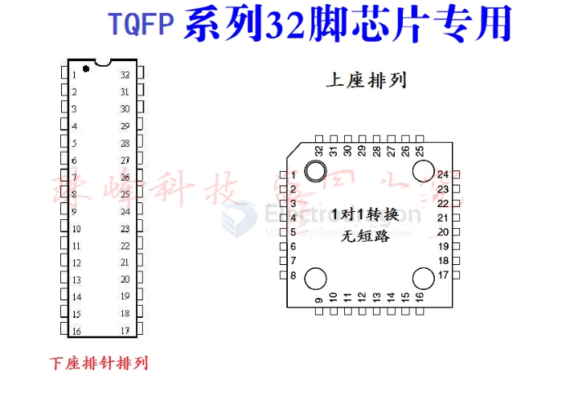
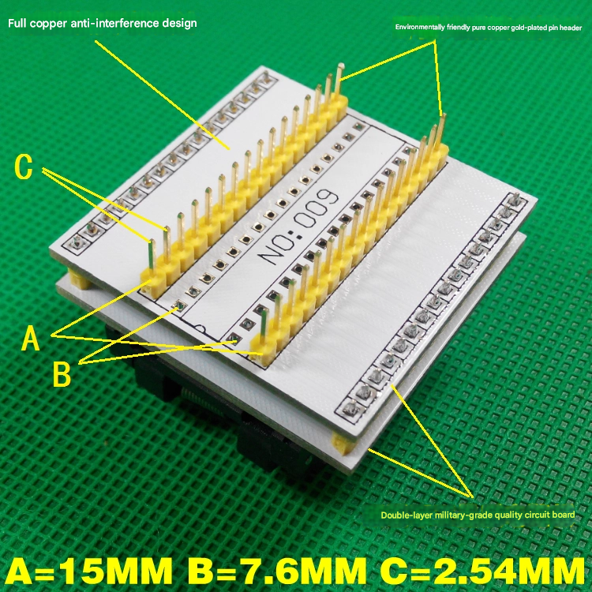
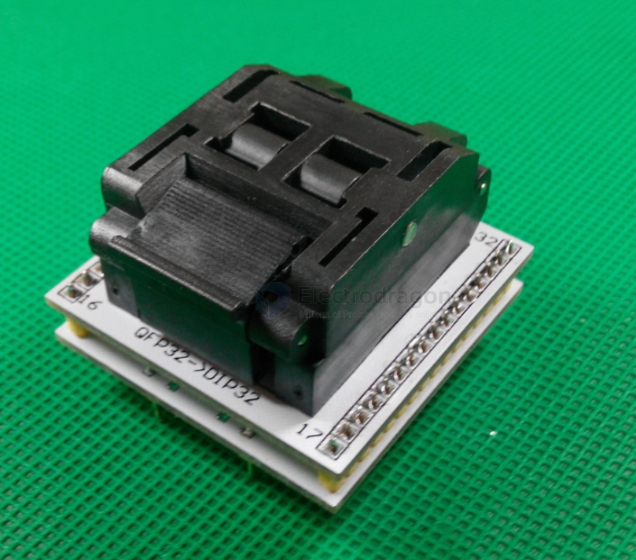

# DPR1016-dat

## Info

[product url - TQFP32 to DIL28 Programmer Socket](https://www.electrodragon.com/product/tqfp32-to-dil28-program-socket/)

### Board Map, Dimension, Pins, chip info, Use Guide, Setup Jumper, etc.

- [[TQFP32-dat]] - [[TQFP-dat]] - [[footprint-dat]]

covert map 

bottom side view 

## Applications, category, tags, etc. 

## Demo Code and Video

## ref 

- [[DPR1016]] 

- legacy wiki page 

