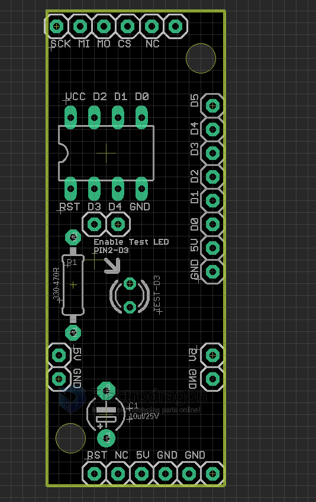
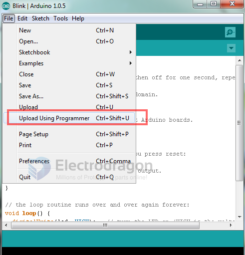
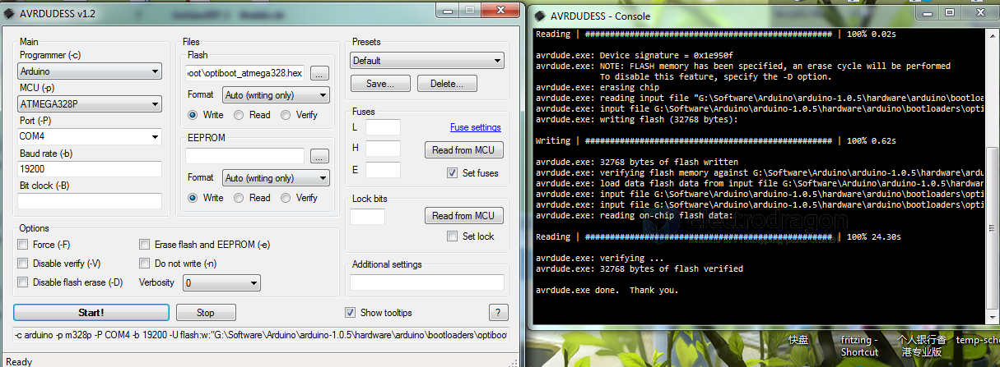

# DPR1045-dat

- board order - https://www.electrodragon.com/product/attiny-1385-programming-shield/
- attiny chip order [[6001274-dat]] - https://www.electrodragon.com/product/attiny13-8-pin-10mhz-1k-4ad/

- legacy wiki page - https://w.electrodragon.com/w/Category:Arduino
- legacy wiki page2 - https://w.electrodragon.com/w/AVR_PROG_Shield#Flash_Bootloader_Programming_Guide_and_Note

## Board Map 

- test LED = PB3
- PB5 ~ PB0 = D5-D0, 6 functional pins of the SOP-8 chip
  - e.g PB3 = D3 
  - digitalWrite(3, HIGH);
- VCC / GND

## Using Guide

Flash Bootloader Programming Guide and Note

- Support three attiny series
- Some version of ArduinoIDE is not working well, for example, 1.61, 1.00, etc, better version approved 1.05, 1.56-r2
- Burn bootloader twice, sometimes it seems the arduinoIDE bug: the IC will fail on uploading sketch when moved to arduino board

- If you see the problem "programmer of out sync", get the easy solution here. [[arduinoISP-dat]]
- Find all the unofficial attiny board files here. [[attiny-dat]]

* upload arduino sketch using "programmer" options in the menu, DO NOT use "upload" button
  

* Program hex file into target IC with AVRDUDESS
  

## Demo with using Guide 

- please see here. 

## ref 

- [[arduinoISP-dat]]