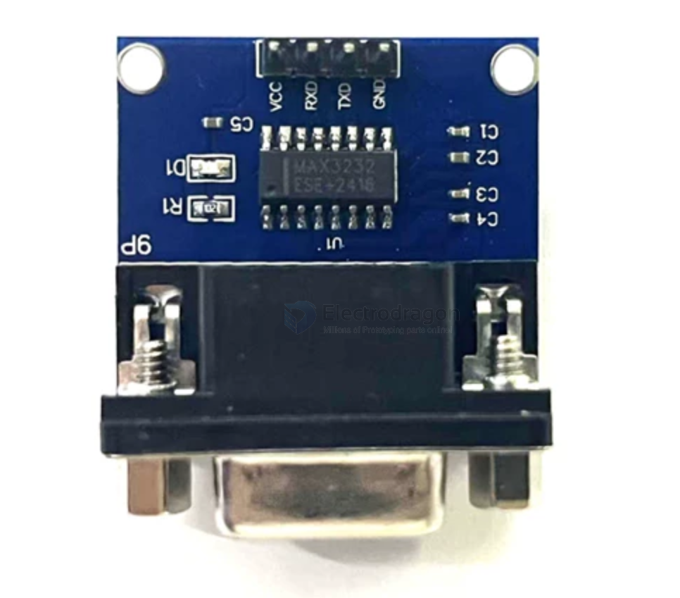

# DPR1073-dat

- [[USB-TTL-dat]] - [[serial-dat]] - [[RS232-dat]]

boards - [[DPR1073-dat]] - [[DPR1054-dat]] - [[NWI1254-dat]]

## board 

## Programming ISP MCUs 

Can program these types of MCUs:
- STC microcontroller - [[STC-dat]]
- STM32 MCU
- NXP microcontroller
- Renesas MCU
- NEC MCU

## ref 

- [[MAX3232-dat]]

- [[DPR1073]]