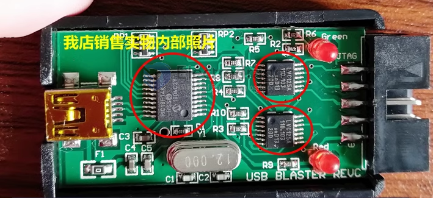

# DPR1077-dat

USB Blaster, ALTERA CPLD/FPGA Programmer

https://www.electrodragon.com/product/usb-blaster-ed-revsion-altera-cpldfpga-programmer/

- with two extra LVC125 chips, better performance  

## Notes 

JTAG protocol communication is a very vulnerable protocol, please avoid interference.

- From JTAG connector to target IC layout please follow the high frequency signal requirement.
- Make sure the PC end of USB balster can supply sufficient power, no interference and no any other USB device use together.
- Eliminate the interference source, such like cell phone, and shorten your USB cable
- if any communication error happened, reconnect the programmer, and restart Quartus II software.

## driver 

- [[USB-Blaster-driver.rar]]

## ref 

- [[DPR1077]]