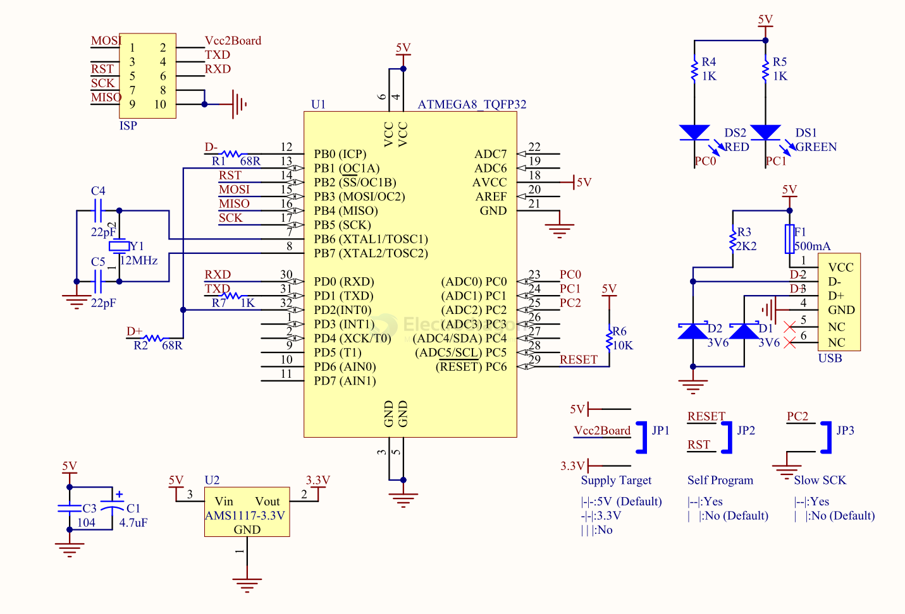

# DPR1088-dat

https://www.electrodragon.com/product/usbasp-programmer-r2-53-3v-supported-avr-arduino/

- [[USBASP-dat]]

## SCH 

## Features

1. Onboard ATMega8 (L) chip
2. With two indicator lights for power supply and programming
3. Onboard overcurrent protection
4. Support 5V and 3.3V power supply for target board

## Support List 

51系列：AT89S51、AT89S52、、AT89S53、AT89S8252

AVR系列： ATTiny12(L)、ATTiny13(V)、ATTiny15(L)、ATTiny24(V)、ATTiny25(V)、ATTiny26(L)、ATTiny2313(V)、ATTiny44(V)、ATTiny45(V)、ATTiny84(V)、ATTiny85(V)、AT90S2313(L)、AT90S2323(L)、AT90S2343(L)、AT90S1200(L)、AT90S8515(L)、AT90S8535(L)、ATMEGA48(V)、ATMEGA8(L)、ATMEGA88(V)、ATMEGA8515(L)、ATMEGA8535(L)、ATMEGA16(L)、ATMEGA162(V)、ATMEGA163(L)、ATMEGA164(V)、ATMEGA165(V)、ATMEGA168(V)、ATMEGA169(V)、ATMEGA169P(V)、ATMEGA32(L)、ATMEGA324(V)、ATMEGA325(V)、ATMEGA3250(V)、ATMEGA329(V)、ATMEGA3290(V)、ATMEGA64(L)、ATMEGA640(V)、ATMEGA644(V)、ATMEGA645(V)、ATMEGA6450(V)、ATMEGA649(V)、ATMEGA6490(V)、ATMEGA128(L)、ATMEGA1280(V)、ATMEGA1281(V)、ATMEGA2560(V)、ATMEGA2561(V)、AT90CAN32、AT90CAN64、AT90CAN128、AT90PWM2(B)、AT90PWM3(B)等

## compatible software 

- [[avrdude-dat]]

## ref 

- [[DPR1088]]

- [[driver-dat]]