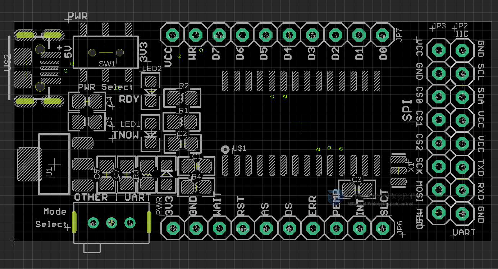

# DPR1093 dat 

legacy wiki page - https://www.electrodragon.com/w/CH340

## version 2

- SW1: switch power supply 5V or 3.3V
- Mode Select: UART mode or all other modes (IIC/SPI EPP/MEM ENBALE)

- RDY LED: ready 
- TNOW LED: TNOW

- Supported Interface: SPI I2C UART, parallel 

## Mode 

### UART

- RDY_LED ON

### Other 

- TNOW_LED ON 

## Version Logs 

Version V1

~~Notice: The VCC pin and GND pin on 4-pin UART interface is reversed on current version, when use it please notice the on board new mark!~~

## Demo Video 

- https://www.youtube.com/watch?v=mDvtJh_AFeM

### ref 

- [[CH341-DAT]]