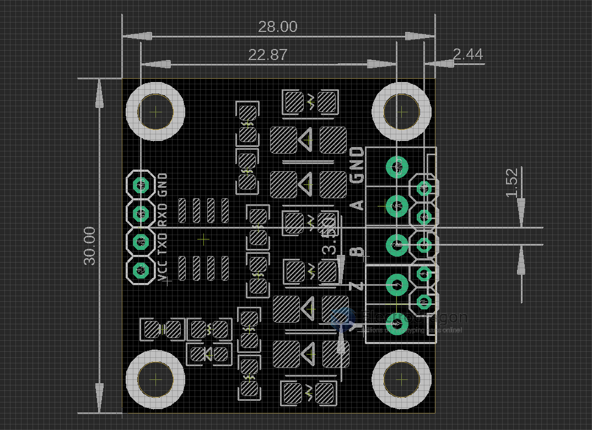

# DPR1097 RS-422

3.3V version - [[DPR1098-dat]]

## Info

[product url - RS422-TTL Module, Full Duplex, RS-422](https://www.electrodragon.com/product/rs422-ttl-module-full-duplex-rs-422/)

## Board Map, Dimension, Pins, etc.

### Pin definition

- GND 
- A = R +
- B = R -
- Z = T-
- Y = T +

### Working Principle 

To run a loop test, connect 

  - A->Y
  - B->Z
 
Connect USB-TTL bridge for example [[PL2303-dat]] or more options from [[serial-dat]] TXD to RXD, RXD to TXD, 5V-5V, GND-GND.

## Applications, category, tags, etc. 

## Demo Code and Video

- [#RS422 loop testing and wiring at 3.3V board](https://t.me/electrodragon3/370)

## old versions 

The ZYBA hole locations are in a different position AND the order has changed to YZBA.

## ref 

- [[RS422-dat]] - [[interface-dat]]

- [legacy wiki page ](https://www.electrodragon.com/w/Category:Interface)
- [RS-422](https://w.electrodragon.com/w/RS-422)

- [[DPR1097]]

- [differential-signal-dat]