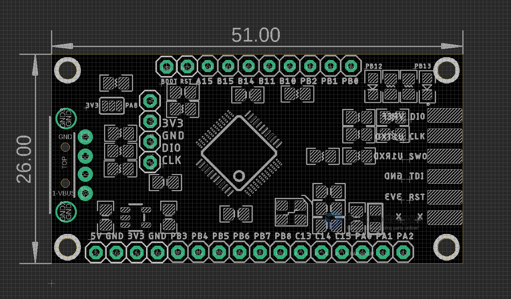
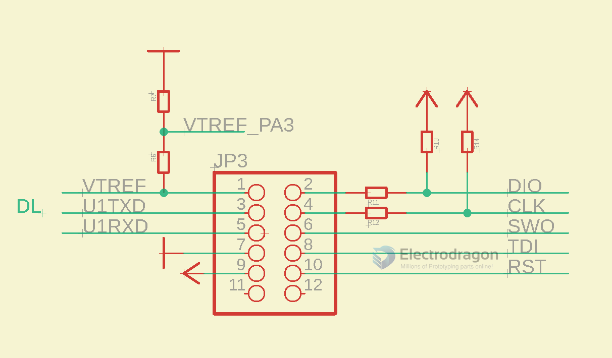

# DPR1100-dat 

[DAPLink CMSIS-DAP Programmer Debugger, Cortex, STM32](https://www.electrodragon.com/product/daplink-cmsis-dap-debugger-arm-cortex-stm32-mdk/)

All functionalities 

- Lead out all pins for [[STM32F103C8T6-dat]], can be used as a development board too 
- Can be used as a [[USB-TTL-dat]] bridge
- recognized in [[MDK-ARM-dat]] as [[CMSIS-dap-dat]]

## Board Map 

LED Indicator 
- PB12
- PB13

## programming port 

- recognized in [[MDK-ARM-dat]] as [[CMSIS-dap-dat]]

- DIO / CLK / SWO / TDI / RST on the front side 
- Programming interface SWD shoul be used: 
  - 3V3
  - GND
  - DIO
  - CLK

## Note 
- Crystal - 8M
- D+ pull-up to PA8 for V2 bootloader, or to 3.3V for V3 bootloader 

## ref 

- [[STM32F103C8T6-dat]] - [[MDK-ARM-dat]] - [[CMSIS-dap-dat]]

- [[DAPLINK-dat]]

- [[DPR1100]] - [[LDO]]