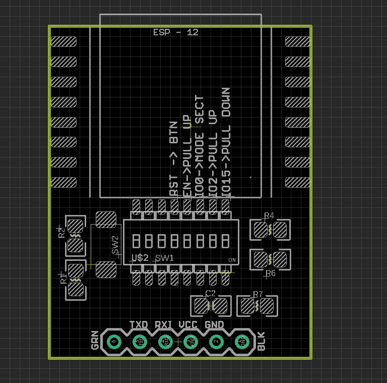

# DPR1106 dat 

https://www.electrodragon.com/product/esp-12-programmer-debugger/

SMD Switch from left to right 

| Pins | ESP Pin Function | Switch Setup                        |
| ---- | ---------------- | ----------------------------------- |
| 1    | -                | -                                   |
| 2    | -                | -                                   |
| 3    | -                | -                                   |
| 4    | Reset            | pull up, enable to the press button |
| 5    | EN               | pull up                             |
| 6    | IO0 (pull-up)    | pull down to Flash Mode             |
| 7    | IO2              | pull up *  (not really necessary)   |
| 8    | IO15             | pull down                           |

## Note 

- Extra 2 spring pogo pins in the package, please note to add to use

Supported Modules 

- [[ESP-12F-dat]] - [[ESP-12S-dat]]

## ref 

- [[pogo-pin-dat]]

- [[DPR1106]]