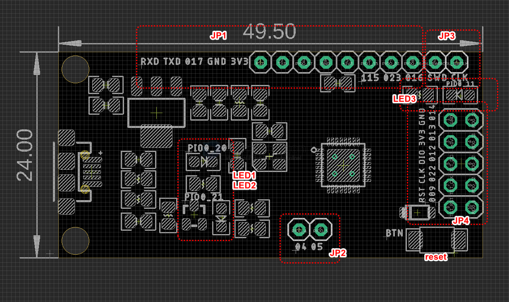
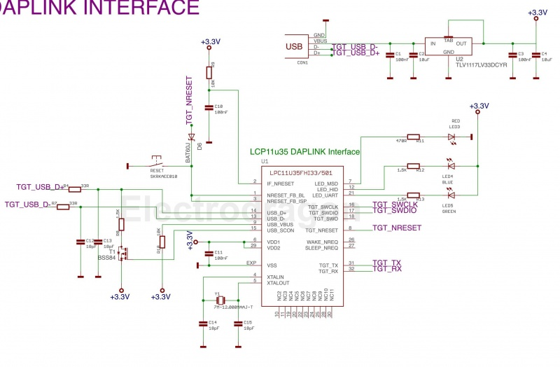

# DPR1116-dat

https://www.electrodragon.com/product/daplink-cmsis-dap-debugger-for-arm-cortex-m-lpc-link/

## Board map 

## schematic 

## Boards peripherals 

- LED1 - PIO20
- LED2 - PIO21
- LED3 - PIO11

- PIO_02 - TGT_RST
- PIO_07 - TGT_CLK
- PIO_08 - TGT_DIO

## extra lead out pins 

JP1

- PIO0_16
- PIO0_23
- PIO1_15 
- 3V3
- GND
- TXD - PIO0_18
- RXD - PIO0_19

JP2
- PIO0_5
- PIO0_4

JP3
- DL_SWCLK
- DL_SWDIO

JP4
- PIO0_9 | TGT_RST
- PIO0_22 | TGT_CLK
- PIO0_12 | TGT_DIO
- PIO0_13 | 3V3
- PIO0_14 | GND
 

## main control 

- LPC11 U35FHI33/501

## tuto 

- find the flash guide here [[Lpc-link_flash.gif]]

## Github DAPlink code, Firmware Updating Guide

[[File:Lpc-link flash.gif|thumbnail]]

* Should only use python 2.7, version 3 may not work

* https://github.com/ARMmbed/DAPLink

| Commands                        | Descriptrions        | -   |
| ------------------------------- | -------------------- | --- |
| pip install virtualenv          | install venv         | -   |
| virtualenv venv                 | activate venv        | -   |
| venv/Scripts/activate.bat       | bat                  | -   |
| pip install -r requirements.txt | install requirements | -   |
| progen generate -t uvision      | setup uvision env    | -   |
| env/Scripts/deactivate.bat      | deactivate bat       | -   |

* GIF left Flash guide please see here, see how to use and program it

* Find project folder J:\Git\LPCLINK\code\DAPLink-2\projectfiles\uvision\lpc11u35_arm_watch_stm32f411_if

* Upgrade board to LPC11U35FNI33/501

* Pin wiring for programming for LPC-LINK programmer to a LPC-LINK Blank programmer
 
    right programmer port CLK -> target top right CLK
    right programmer port DIO -> target top right DIO
    3.3V -> 3.3V
    GND -> GND

## firmware 

- [Firmware from DAPLINK github.](https://github.com/ARMmbed/DAPLink)

## Reference 

* Mbed serial port driver  - https://os.mbed.com/handbook/Windows-serial-configuration
