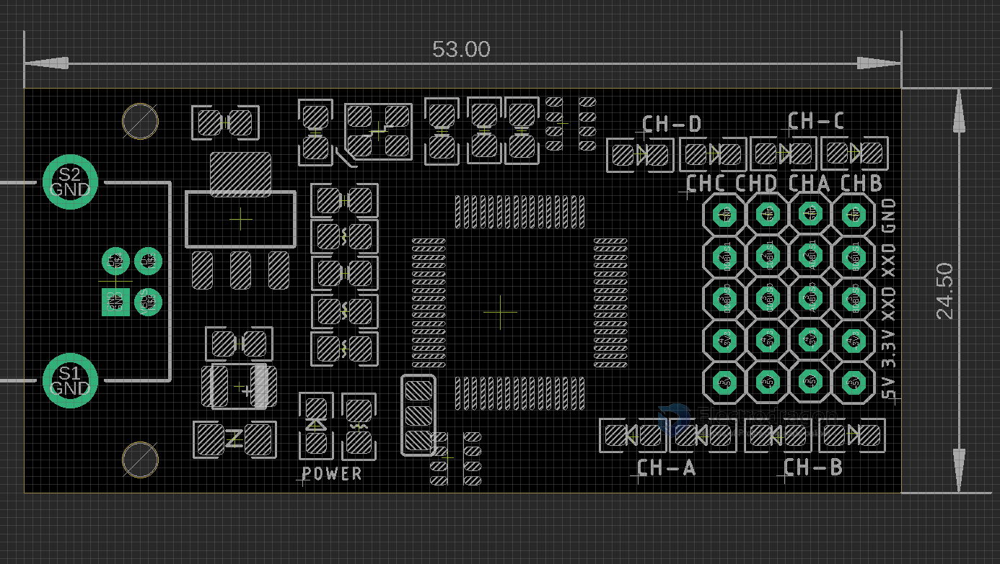

# DPR1120 dat 

## Dimension 

- 4x groups LEDs of UART 
- one power LED indicator 
- VCCIO - IOs VCC selectable 3.3V or 5V
- Each group output pins: GND, xx, xx, 3.3V, +5V

## usage

- remove the jumpers, which are for our factory test purpose only 

## ref 

- [[FT4232-dat]] - [[USB-TTL-dat]]
  
- [[ft4232]] - [[DPR1120]]
