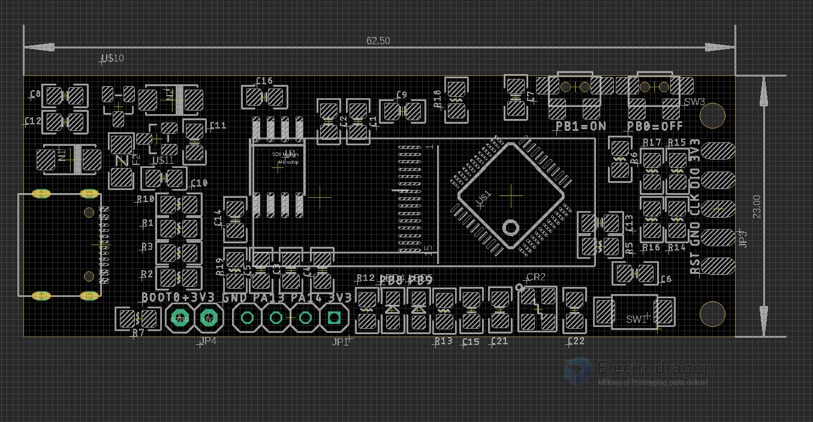
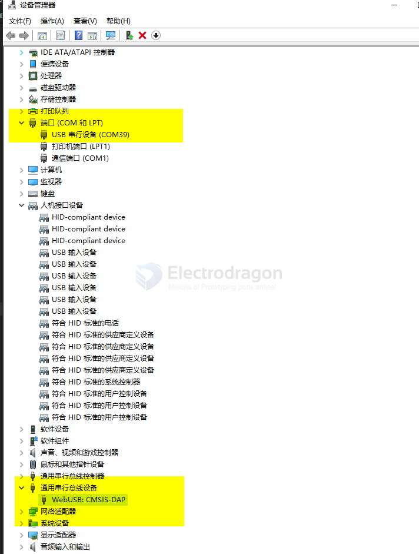

# DPR1130 DAT STM32 offline programmer 

https://www.electrodragon.com/product/chip-holdstm32-online-offline-programmer-daplink-off-prog/

- legacy wiki page - https://w.electrodragon.com/w/STM32_OFF-PROG

## Usage 

- hold down PB0=OFF button and plug in USB cable into OFFLINE mode 
- hold down PB1=ON button and plug in USB cable into  ONLINE mode 

### online mode 

the programmer comes up two part of functions 
- serial USB-TTL port 
- CMSIS-DAP programmer: please use IDE/SDK like keil-MDK to run it 

please make sure to use a good quality USB-cable, a different USB cable to try is also a good option 

### offline mode 
- ready to use out of the box
* Power board by powerbank or other USB power supply
* Connect target via SWD four pins: SWD CLK 3V3 GND

* Target will be automatically detected and displayed "connected"
* Select correct flash methods, *.v file
* select correct firmware bin file
* and upload by click "start"
* target will be auto reset

### work flow 

- please hold down PB1 into online mode, and copy your target bin file into the root folder
- hold down PB0 and re-enter into offline mode
- connect the target board, and programmer should show "connected"
- choose the target board config file, and choose target flashing bin file 
- hit the "start" to program

## hardware 
- PA13 = target SWDIO
- PA14 = target SWCLK
- PB8 LED status 1
- PB9 LED status 2
- PB1 = button to online mode
- PB0 = button to offline mode
- SW1 = boot0 self programming button 

output 
* Front top-bottom: 3V3 DIO CLK GND RESET
* Back Top-bottom: 3V3 TXD RXD GND +5V
* Button only use side ON and OFF button, reset button is not necessary to use

## folder setup 

- IVES: board config files, keep it default 
- KEYS: cryption files, normally no need
- all the programming bin file, leave in the root folder 

## Specs 
- Disk Size = 4MB = on board flash 

## Supported devices:

| target family | target ROM memory size | file    |
| ------------- | ---------------------- | ------- |
| STM32 F0xx    | all                    | F0XX    |
| STM32 F10x    | 512K or less           | F10X_MD |
| STM32 F10x    | 512K or more           | F10X_HD |
| STM32 F3XX    | 256K                   | F3XX_MD |
| STM32 F3XX    | 512K                   | F3XX_HD |
| STM32 F4XX    | 512K or less           | F4XX_LD |
| STM32 F4XX    | 1024K                  | F4XX_MD |
| STM32 F4XX    | 2048K                  | F4XX_HD |

The file list; 

- F0

- F3xx_HD
- F3xx_MD

- F4xx_HD
- F4xx_LD
- F4xx_MD

- F7x_128

- F10x_HD
- F10x_MD

- HC32F005
- HC32L136

## demo video 

### programming STM32F103

- https://twitter.com/electro_phoenix/status/1394564729524432900?s=19
- https://www.youtube.com/shorts/PqV0fQ9DFEk

- target programming board [[DOD1046-dat]] - https://www.electrodragon.com/product/arm-stm32f103c8t6-mini-development-board-r2/

- programming port GND - SWCLK - SWIO - 3V3

## ref 

- [[STM32-dat]]

- [[DPR1130]]