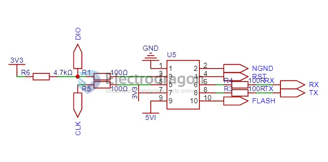
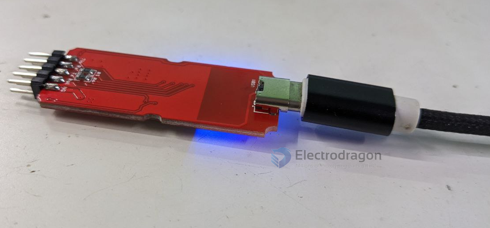
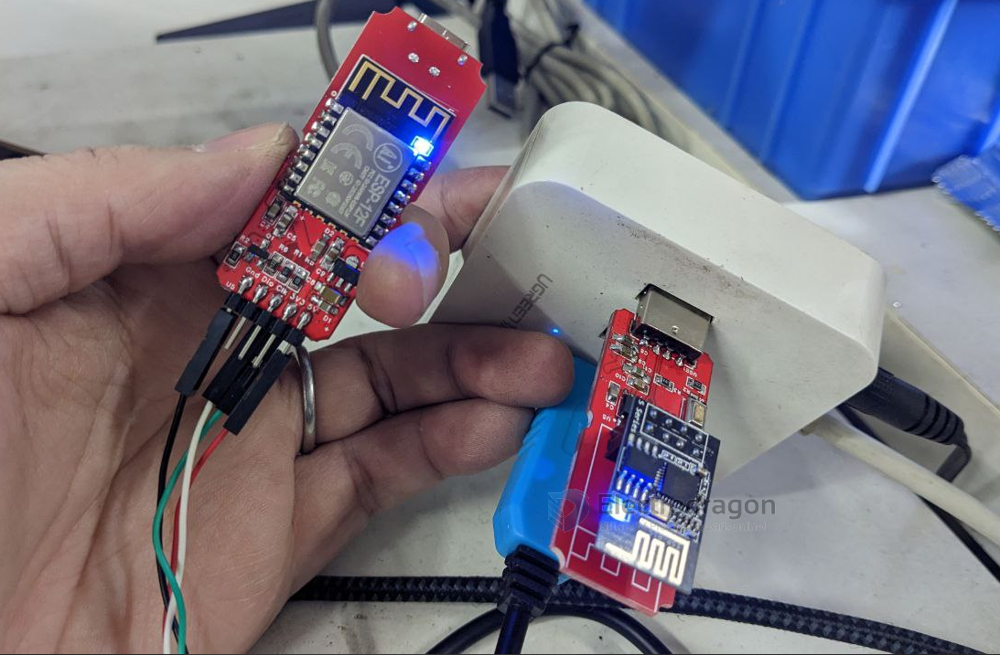
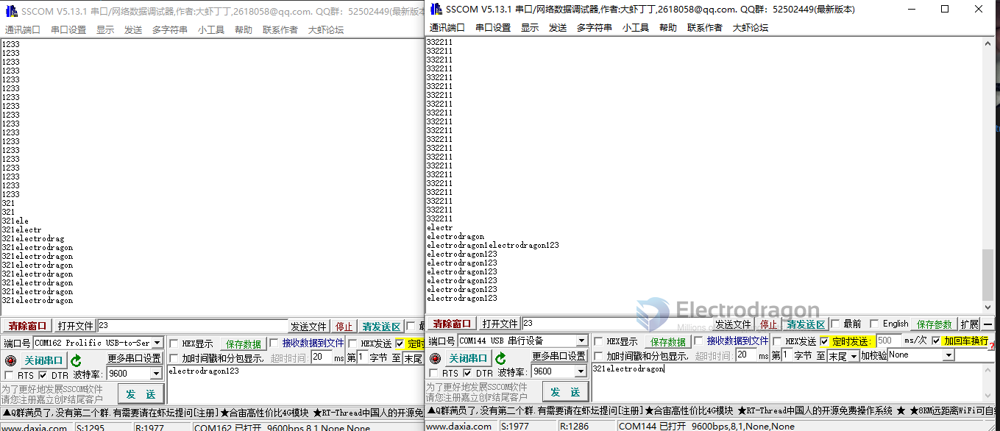

# DPR1150 DAT

https://www.electrodragon.com/product/wireless-debugger-usb-ttl-cmsis-dap/

## guide

Sender

- Server Side please connect to your PC USB port for data sending

Receiver

- Power only for target receiver side, USB port Type-C

Actions

- wait for both side on-module LED turn ON Blue
- and it is ready to use

## sender

- [[CH552-dat]] + [[ESP-01S-dat]]

flash by dev board - [[NWI1070-dat]]

## receiver

- [[ESP-12F-dat]]

Pin Definitions

| Left Out | Left ESP Pin | Right ESP Pin | Right Out |
| -------- | ------------ | ------------- | --------- |
| GND      | GND          | NGND          | NGND      |
| DIO      | GPIO 5       | RST           | GPIO 12   |
| CLK      | GPIO 4       | RX            | RX        |
| 3V3      | 3V3          | TX            | TX        |
| 5V       | 5V           | GPIO 0        | Flash     |

## ref

- [[DPR1150]]

- firmware - https://github.com/Edragon/ESP8266-proj

## Demos

- https://twitter.com/electro_phoenix/status/1640668945953996803
