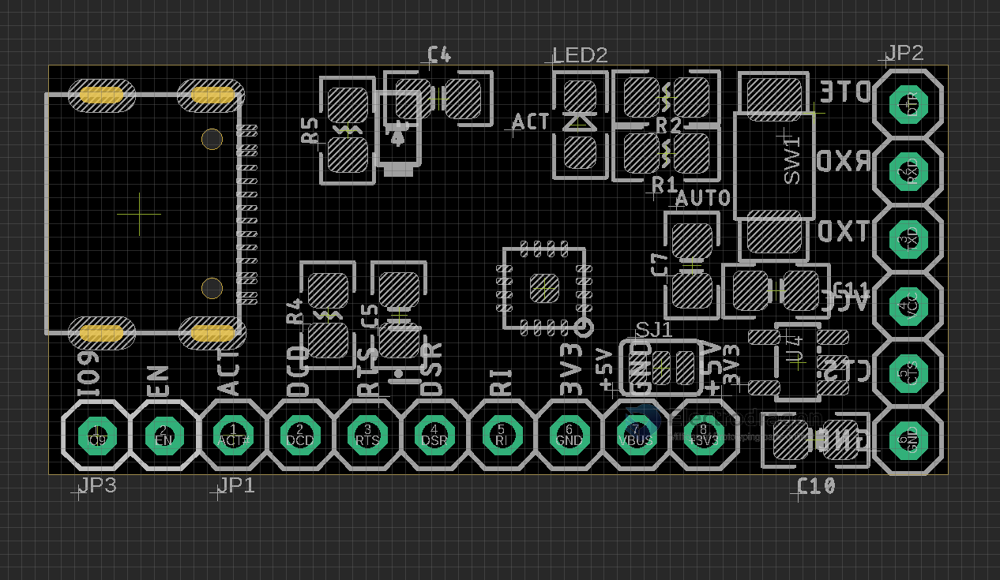

# DPR1153 

## Board 

Pin Definitions 

- DTE
- RXD
- TXD
- VCC
- CTS
- GND 

Features 
- VIO Select 5V or 3V3 
- on board LDO for 3V3 

Reserved only - [[auto-serial-dat]], please contact for MOQ 10pcs order, or simply add order note

## ref 

- [[CH343-dat]] - [[serial-dat]]