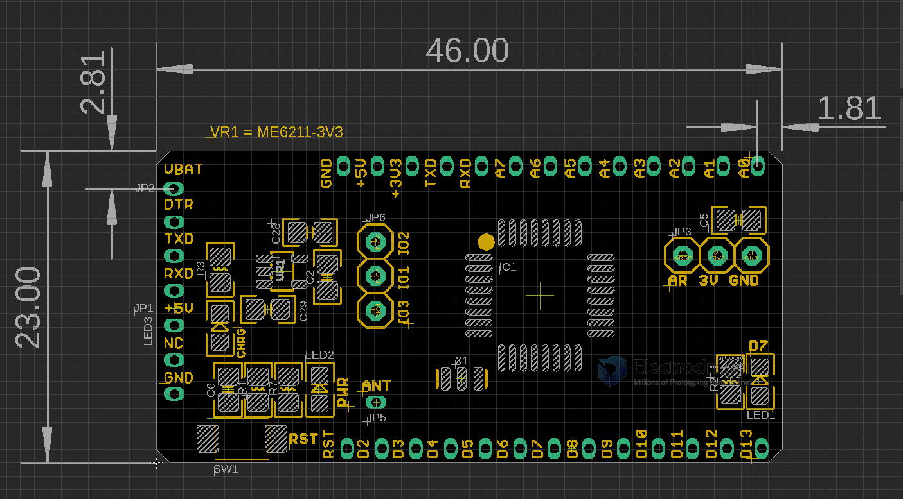
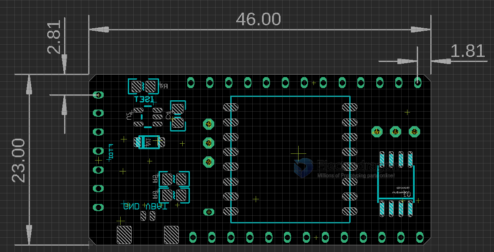

# DVA1007 DAT

legacy wiki page
- https://w.electrodragon.com/w/Loraduino

## hardware setup 

| Function Pin | category | Arduino |
| ------------ | -------- | ------- |
| Flash_CS     | D8       | Flash   |
| LED          | D7       | LED     |
| RF_CS        | D10      | SX1278  |
| RF_INT       | D2       | SX1278  |
| RF_RST       | D8       | SX1278  |
| Voltage-Dect | A7       |         |

### Board Map 

### Pin Definitions

FT232 Programming Port 
- VBAT
- DTR
- TXD
- RXD
- +5V
- GND
- --

- [[arduino-lib]]

## Radio Lora Network 
- arduino library radiohead

## flash 
- must well initiated flash into low power mode 
- 0xEF40 manufactuer ID for 16mbit
- [[flash]] - user lowpower lab flash arduino library 

## bootloader 
- arduino pro mini 3.3V/8M 

## low power mode 
- first init RF Lora 
- then, must well initiated flash, or this cost 1-2 mA - https://github.com/LowPowerLab/SPIFlash
- turn RF Lora into sleep mode, or this cost 1-2 mA
- turn on arduino into low power mode - https://github.com/LowPowerLab/LowPower
- arduino low power, powerdown and wake up periodically 
- [[low-power-test-dat]]

## Lora Modules 

- [[NWL1071-dat]] - [[NWL1072-dat]]

- [[LDO-dat]]

- [[DVA1007]] - [[DVA1008]] - [[DVA1009]]