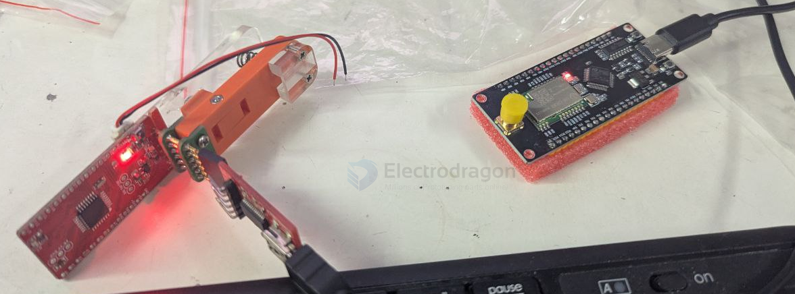
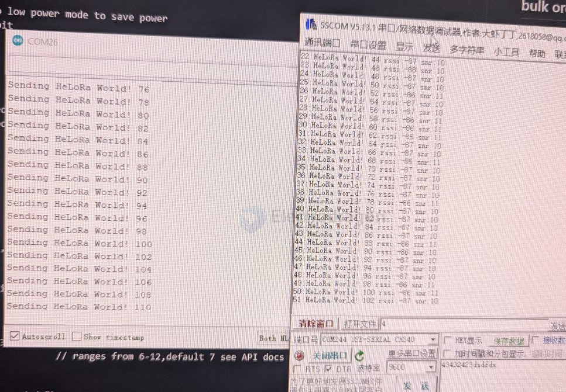

# DVA1007-DAT

- relevant [[MPC1056-dat]]

[legacy wiki page](https://w.electrodragon.com/w/Loraduino)

[Loraduino Lora RF Wireless Dev. Board, Arduino Compatible](https://www.electrodragon.com/product/atmega328p-arduino-plus-lora-sx1278-board-loraduino/)

- 433MHZ version [[DVA1007-DAT]] - 915Mhz version [[DVA1008-DAT]]

- [[lora-SDK-dat]]

### Board Map 

Pin Definitions 

| Function Pin | SPI | category | Arduino |
| ------------ | --- | -------- | ------- |
| Flash_CS     | CS  | D8       | Flash   |
| LED          |     | D7       | LED     |
| RF_CS        | CS  | D10      | SX1278  |
| RF_INT       |     | D2       | SX1278  |
| RF_RST       |     | D8       | SX1278  |
| Voltage-Dect |     | A7       |         |

### Pin Definitions

[[FT232-dat]] FT232 Programming Port 

- VBAT (optional)
- DTR
- TXD
- RXD
- +5V
- GND (CTS)
- -- (GND)

## Functions and tech 

- [[memory-dat]] - [[low-power-dat]] - [[lora-dat]]

- [[battery-charger-dat]] - [[LDO-dat]]

Lora Modules - [[NWL1071-dat]] - [[NWL1072-dat]]

- [[spi-flash-dat]]
- must well initiated flash into low power mode to save power 
- 0xEF40 manufactuer ID for 16mbit

Pins table

| arduino | pin | Funcs | Funcs2         | customize |
| ------- | --- | ----- | -------------- | --------- |
| D13     | 17  | PB5   | SPI_SCK/PCINT5 | SPI_SCK   |
| D12     | 16  | PB4   | SPI_MISO       | SPI_MISO  |
| D11     | 15  | PB3   | SPI_MOSI/PWM   | SPI_MOSI  |
| D10     | 14  | PB2   |                | LORA_CS   |
| D9      | 13  | PB1   | PWM            | LORA_RST  |
| D8      | 12  | PB0   |                | Flash_CS  |
| D7      | 11  | PD7   |                | LED       |
| D6      | 10  | PD6   | PWM            |           |
| D5      | 9   | PD5   | PWM            |           |
| D4      | 2   | PD4   |                |           |
| D3      | 1   | PD3   | PWM            |           |
| D2      | 32  | PD2   | irq            | LORA_IRQ  |
| D1      | 31  | PD1   | TX             |           |
| D0      | 30  | PD0   | RX             |           |
| A5      |     | PC5   | SCL            |           |
| A4      |     | PC4   | SDA            |           |
| A3      |     | PC3   |                |           |
| A2      |     | PC2   |                |           |
| A1      |     | PC1   |                |           |
| A0      |     | PC0   |                |           |

## demo code 

- [[lora-SDK-dat]] == https://github.com/sandeepmistry/arduino-LoRa
- arduino library **radiohead** - [[arduino-lib-dat]]
- [[spi-flash-dat]] - user lowpower lab flash arduino library 

bootloader - arduino pro mini 3.3V/8M == [[arduino-dat]]

### coding config 

    const int csPin = 10;          // LoRa radio chip select
    const int resetPin = 9;       // LoRa radio reset
    const int irqPin = 2;         // change for your board; must be a hardware interrupt pin
    ...

    LoRa.setPins(csPin, resetPin, irqPin); // set CS, reset, IRQ pin

    if (!LoRa.begin(868E6)) {             // initialize ratio at 915 MHz
    Serial.println("LoRa init failed. Check your connections.");
    while (true);                       // if failed, do nothing
    }

    LoRa.setSignalBandwidth(125E3);
    LoRa.setSpreadingFactor(9);           // ranges from 6-12,default 7 see API docs
    LoRa.setCodingRate4(4/6);

    Serial.println("LoRa init succeeded.");

- from USB Lora Board to [[DVA1008-dat]] running at 868mhz 

 

 

## demo video 

- [low power test](https://x.com/electro_phoenix/status/1639160253811142656)

## bulk order 

Buck order price: 

- 16% discount for 100-499pcs order, 
- 20% for 500pcs+ order. Auto update price.

## ref 

- [[DVA1007]] - [[DVA1008]] - [[DVA1009]]

- [[radiohead-dat]] - [[lora-sdk-dat]]

- [[arduino-hdk-dat]] - [[arduino-dat]]