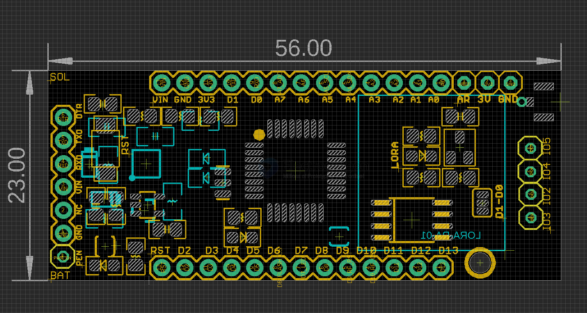

# DVA1010-dat

- [[power-dat]] - [[Power-distribution-dat]] - [[consonance-dat]] - [[CN3065-dat]]

- [[lora-dat]]

- [[arduino-dat]] - [[FTDI-dat]] - [[FT232-dat]] - [[serial-dat]]

- [[DVA1010-dat]] - [[atmega328-dat]] == [[SX1262-dat]] + [[LLCC68-dat]]

- [[DVA1009-dat]] - [[LGT8F328-dat]] == [[SX1262-dat]] + [[LLCC68-dat]]

- [[DVA1007-dat]] - [[DVA1008-dat]] == [[atmega328-dat]] + [[SX1278-dat]]

## board map 

## ref 

