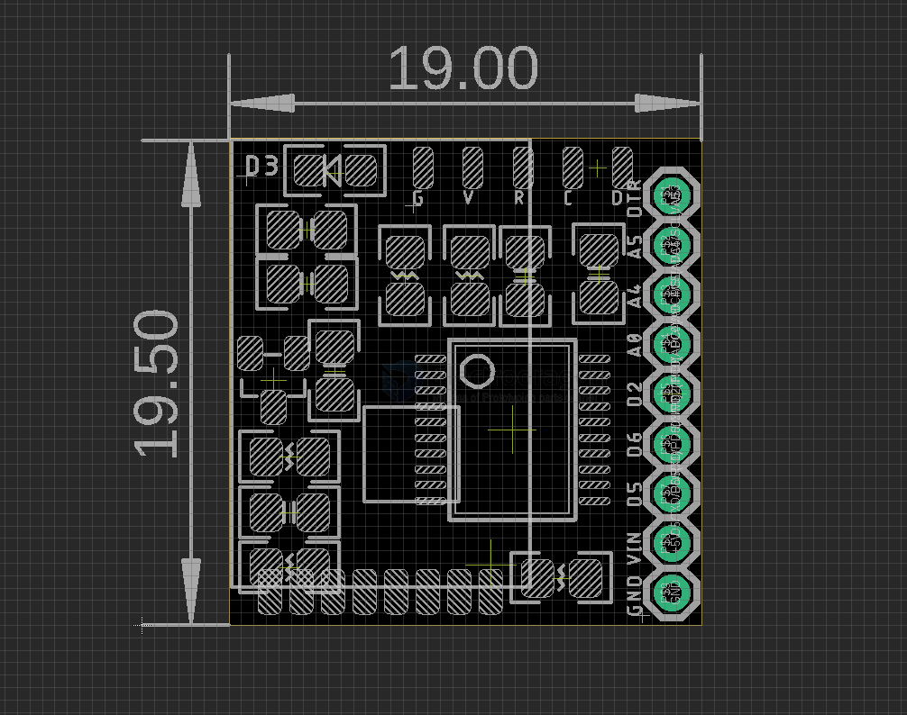

# DVA1014-dat

## Info

product url - 

### Board Map, Dimension, Pins, chip info, Use Guide, Setup Jumper, etc.

- [[NRF24L01-dat]] - [[NRF24L01-clone-dat]]

- [[LGT8F328-DAT]] - [[LGT8F328-SSOP20-dat]] - [[LGT-dat]] - [[arduino-dat]] - [[LGT8F328-SDK-DAT]]

## Applications, category, tags, etc. 

## Demo Code and Video

## ref 

- [[]] 

- legacy wiki page 

