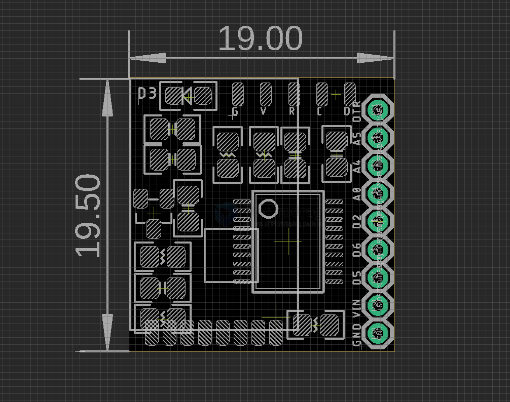

# DVA1014-dat

## Info

product url - 

### Board Map, Dimension, Pins, chip info, Use Guide, Setup Jumper, etc.

- [[NRF24L01-dat]] - [[NRF24L01-clone-dat]]

- [[LGT8F328-DAT]] - [[LGT8F328-SSOP20-dat]] - [[LGT-dat]] - [[arduino-dat]] - [[LGT8F328-SDK-DAT]]

- [[LDO-dat]]

pin definitions 

- DTR
- A5 
- A4
- A0 
- D2
- D6 / TXD
- D5 / RXD
- VIN
- GND 

on board LED == D3 

programmer pin G / V / R / C / D == GND / VIN / RST / SWC / SWD

## Applications, category, tags, etc. 

## Demo Code and Video

## ref 

- [[DVA1014]] 

- legacy wiki page 

