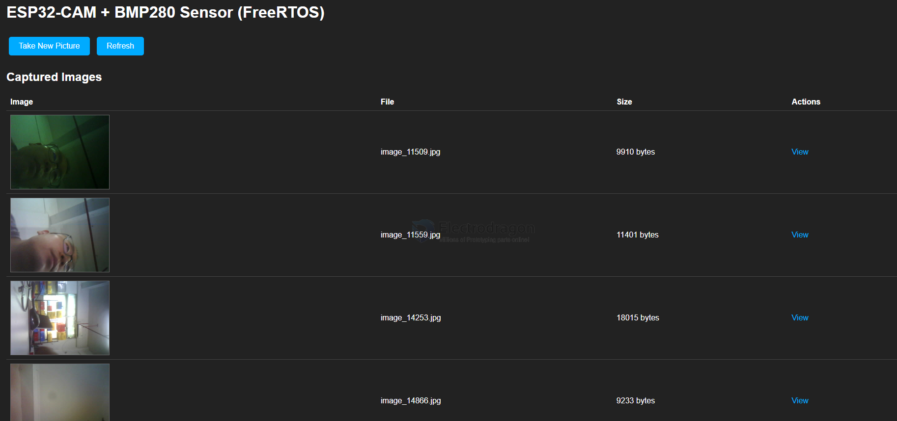
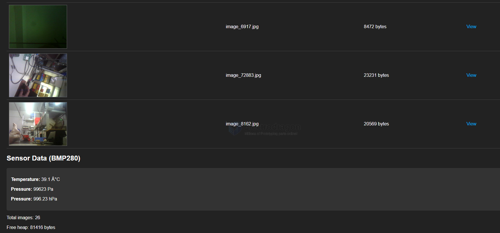

# ESP1000-code-dat

https://github.com/Edragon/Arduino-ESP32/tree/master/BSP/ESP/ESP1000-ESP32-tori

## code version 2 

rtos-cam-web-2.ino 

### ESP32-CAM + BMP280 Project Functions

#### Core Functions
• **Image Capture** - Auto (60s), manual web button, GPIO3 trigger
• **File Storage** - LittleFS with chunked writing (no PSRAM optimization)
• **LED Feedback** - Dual blink on GPIO33/GPIO4 during capture
• **Environmental Monitor** - BMP280 temp/pressure every 5s
• **Web Interface** - Image gallery + live sensor data
• **OLED Display** - Real-time sensor readings + WiFi status

#### Hardware I/O
• **Camera** - AI-THINKER ESP32-CAM (VGA, JPEG quality 15)
• **I2C Bus** - OLED (0x3C) + BMP280 (0x76) on GPIO15/13
• **GPIO Trigger** - Rising edge interrupt on GPIO3
• **LED Outputs** - GPIO33, GPIO4 (2x 100ms blinks per capture)
• **WiFi** - Station mode with web server on port 80

#### FreeRTOS Tasks
• **Camera Task** - Core 1, Priority 2, 10KB stack
• **Sensor Task** - Core 0, Priority 1, 3KB stack  
• **Display Task** - Core 0, Priority 1, 4KB stack
• **Web Server Task** - Core 0, Priority 1, 6KB stack

#### Data Display
• **Temperature** - Celsius (1 decimal)
• **Pressure** - Pa + hPa conversion
• **Web Dashboard** - Dark theme with thumbnails
• **System Monitor** - Heap usage, task