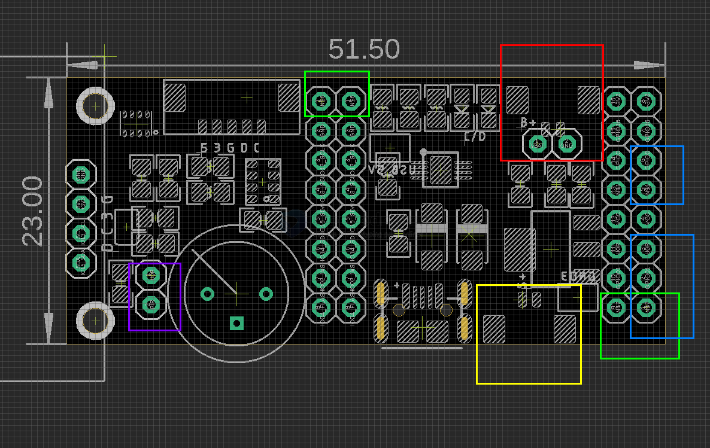
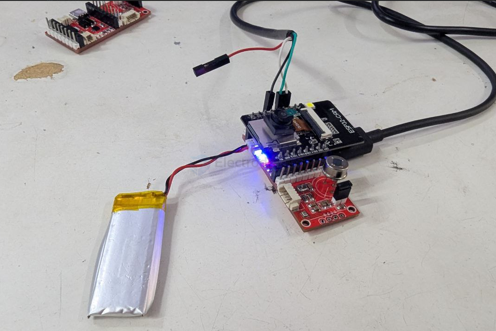
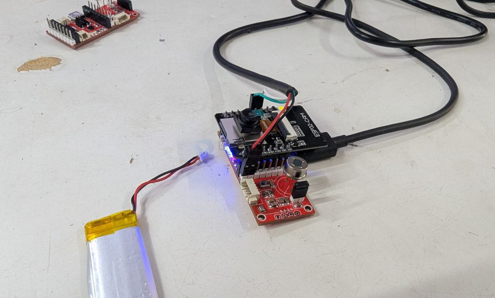

# ESP1000-dat

Module based on [[SCM1030-dat]]

## All in one Pin Map 

| ESP32 L_Pin | ESP32_CAM | tori     | ESP32 M_Pin | ESP32_CAM | tori   | ESP32 R_Pin | ESP32_CAM      | tori |
| ----------- | --------- | -------- | ----------- | --------- | ------ | ----------- | -------------- | ---- |
| GND         |           |          | GND2        |           |        | GND         |                |      |
| 3V3         |           |          | 13          | microSD   | SCL    | 23          | CAM            |      |
| EN          |           |          | SD2         | PSRAM     |        | 22          | CAM            |      |
| 36          | CAM       |          | SD3         | PSRAM     |        | TXD0        |                |      |
| 39          | CAM       |          | CMD         |           |        | RXD0        |                | PIR  |
| 34          | CAM       |          | CLK         |           |        | 21          | CAM            |      |
| 35          | CAM       |          | SD0         | PSRAM     |        | --          |                |      |
| 32          | CAM_PWR   |          | SD1         | PSRAM     |        | 19          | CAM            |      |
| 33          |           |          | 15          | microSD   | SDA    | 18          | CAM            |      |
| 25          |           |          | 2           | microSD   | I2S_WS | 5           | CAM            |      |
| 26          | CAM       |          |             |           |        | 17          | PSRAM          |      |
| 27          | CAM       |          |             |           |        | 16          | PSRAM          |      |
| 14          | microSD   | I2S_SD   |             |           |        | 4           | microSD, flash |      |
| 12          | microSD   | I2S_SCLK |             |           |        | 0           | CAM            |      |

## Board map 

### Programming Note 

- Purple box jumper must be disconnected for enabling RXD0, otherwise used by PIR sensor 
- Connect purple box by a jumper to enter into programming mode 

### Power Supply 

- top-left green box will be used for power ESP32 ONLY, not for our this based board
- To use our this base board sensors while debugging, please use: 
  - Lihtium battery + USB Cable 
  - USB-TTL debug power supply + USB Cable 

### ESP32-CAM Version Note

- version V1701 GND3 is not woring, please read at [[SCM1030-dat]], just bend this pin or cut if off to leave it

## In Use 

- [[I2S-dat]] - [[I2S-microphone-dat]]

- [[PIR-sensor-dat]] 

- [[OLED-dat]] 
  
- [[sensor-dat]] - [[I2C-dat]] - [[BME280-dat]] - [[BMP280-dat]]

- [[consonance-dat]] - [[solar-power-dat]] - [[battery-dat]] - [[lithium-ion-battery-dat]]

- [[ESP32-dat]] - [[SCM1030-dat]]

## Not in Use  

- [[SD-dat]]

- [[IP5306-dat]]

## Demo Code 

- https://github.com/Edragon/Arduino-ESP32/tree/master/BSP/APP/ESP32-tori

## Demo Video 

- [default camera log, powered by battery](https://x.com/electro_phoenix/status/1881569671020949656) 
- [I2S camera sound detect](https://x.com/electro_phoenix/status/1877590478109159437)
- [PIR sensor detector](https://x.com/electro_phoenix/status/1877256534687650008)

## ref 

- [[ESP1000]]