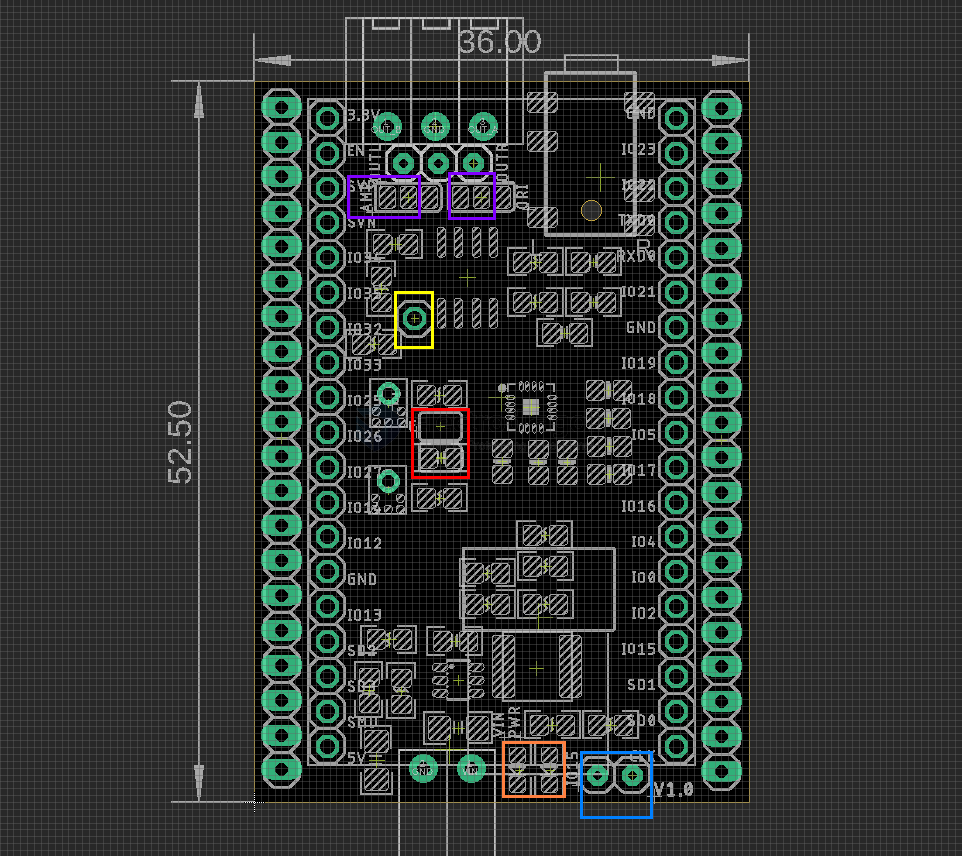

# ESP1008-dat

old called esp32-i2s-board

## Info

product url - 

### Board Map, Dimension, Pins, etc.

- set purple pin jumpers to left for audio amplifier, and right for direct output 
- yellow pin to set to mute the amplifier 
- red to set left or right channels for two microphones 
- orange leds for power indication and IO15 programmer led
- blue pins for SD MMC high speed SD card setup IO2 

## Applications, category, tags, etc. 

## SDMMC_Test 

fully bit-3 control 

    int clk = 14;
    int cmd = 15;
    int d0 = 2;
    int d1 = 4;
    int d2 = 12;
    int d3 = 13;  // GPIO 34 is not broken-out on ESP32-S3-DevKitC-1 v1.1

 

## SD SPI setup 

very simple bit0 control 

    #define SD_CS         13   // SD card chip select
    #define SD_MOSI       15  // Custom MOSI pin
    #define SD_MISO       02  // Custom MISO pin
    #define SD_SCK        14  // Custom SCK pin

## I2S microphone 

see demo video of frequency below 

[[I2S-microphone-dat]] - [[MSM261S4030H0R-dat]]
  
    #define MIC_BCK_PIN 33            // Clock pin from the mic.
    #define MIC_WS_PIN 27             // WS pin from the mic.
    #define MIC_DATA_PIN 32           // SD pin data from the mic.
    #define MIC_CHANNEL_SELECT_PIN -1 // Left/Right pin to select the channel output from the mic.

## I2S speaker 

see microSD read wav file and play demo video below 

[[Audio-amplifier-dat]]

    #define I2S_DOUT      26  // I2S Data Output
    #define I2S_BCLK      5  // I2S Bit Clock
    #define I2S_LRC       25  // I2S Left-Right Clock

or 

    //i2s.setPins(I2S_SCK/BCLK, I2S_WS/LRC, I2S_SDOUT, I2S_SDIN, I2S_MCLK);
    i2s.setPins(5, 25, 26, -1, -1);

## amplifier

- [[AMP1021-dat]]

## demo video

- [serial raw read ](https://t.me/electrodragon3/346)
- [serial read frequency ](https://t.me/electrodragon3/347)
- [I2S speaker with amplifier, play WAV file from SD card ](https://t.me/electrodragon3/348)

## code 

- [[I2S-dat]]

- [ESP32](https://github.com/Edragon/Arduino-ESP32) 

## ref 

- [[audio-dat]] - [[esp32-shields-dat]]

- irrelevant == - [[SCM1030-dat]] 

- [[ESP1008]] 

