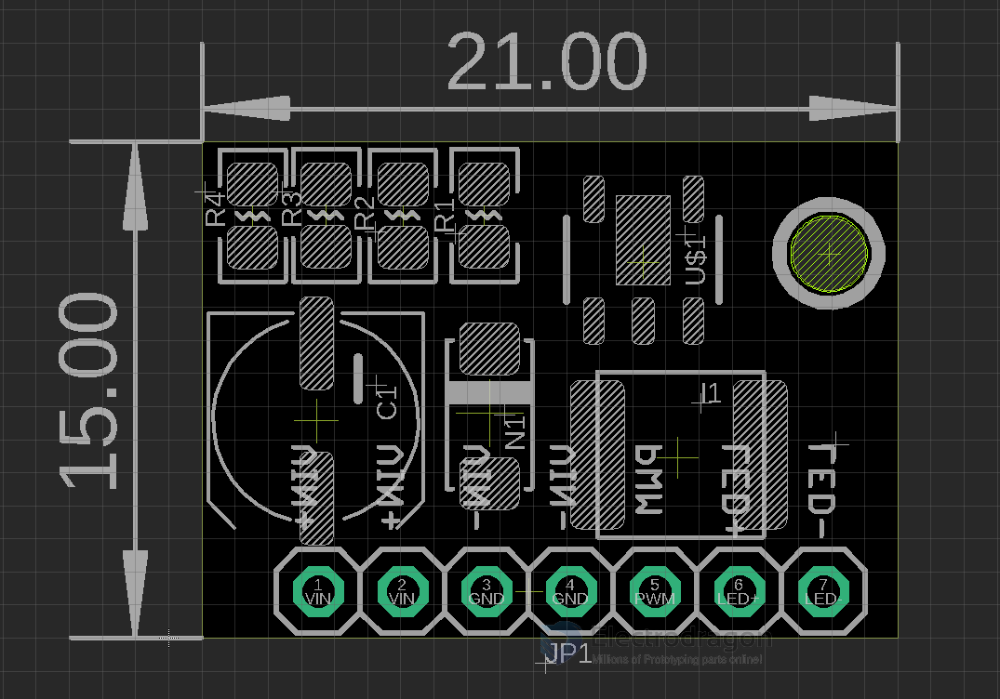

# IDD1002-dat

Breakout board support up to

- [1W, 10W, 30W high power LEDs in our store](https://www.electrodragon.com/product/high-power-full-white-led-variable100w30w50w20w/)
- also can shortly or not [fully power 50W or 100W LEDs](https://www.electrodragon.com/product/high-power-full-white-led-variable100w30w50w20w/). 33V for 100W LEDs can work but not recommdedded for long term.
- [Tested 5 Meters LED white strips.](https://www.electrodragon.com/product/super-light-led-light-strips/)
- Pin Definition:
  - IN +: Positive power supply IN-: Power supply negative.
  - LED +: Connect the LED’s anode LED-:  Connect the LED’s cathode
  - PWM: Light Strengh control: dimming control signal (2.8V-6V turn on)
- PWM signal limit frequency: 20HZ-20KHZ, recommendations: 1KHZ or so
- Each purchase is for 2 pieces boards.

- [[led-driver-dat]]