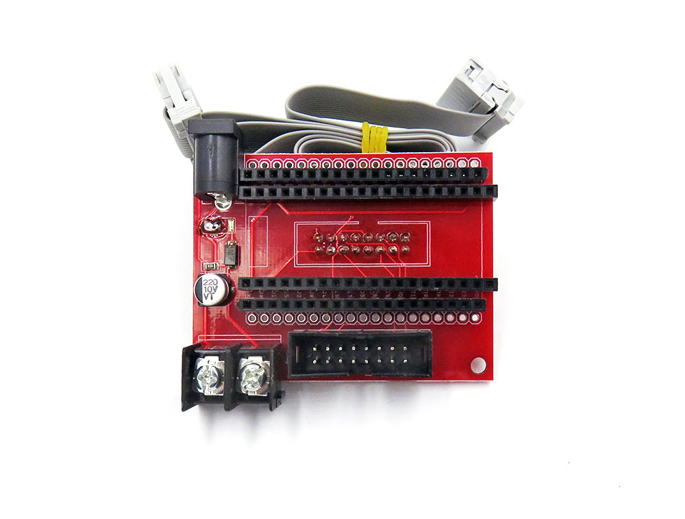

# IDD1016 DAT RGB Matrix Panel Drive Interface Board for ESP32

https://w.electrodragon.com/w/ESP32_RMP

## Board map 

- only spare pins IO10 IO9 IO38 IO37
- SEL1 pin is the SEL-PIN4 in [[HUB75-dat]]

## Use guide

You will need ESP32 main controller board to stack on it. Includes:

- [[NWI1206-dat]] - [[NWI1100-dat]]

- [[NWI1145-dat]]

## PxMatrix Configuration

* #define P_LAT 22

* #define P_A 19
* #define P_B 23
* #define P_C 18
* #define P_D 5
* #define P_E 15

Notice to set for ESP32-DEVKITC or ESP32-DEVKITC accordingly, as below:

For ESP32-DEVKITC
* #define P_OE 16 

For ESP32-PICO
* #define P_OE 12

The rest fixed used pin
* CLK = 14 
* R1 = 13 

detailed wiring please refer to [pxmatrix code](https://github.com/2dom/PxMatrix)

## demo code 

- Github code https://github.com/2dom/PxMatrix
- work with default demo code above 

## demo video 

- PxMatrix Demo video - https://t.me/electrodragon3/20
- ESP32 with [[IDD1016-dat]] based on code PxMatrix - https://t.me/electrodragon3/41
-  more 1 - https://t.me/electrodragon3/146
## ref 

- [[RMP-driver-dat]]