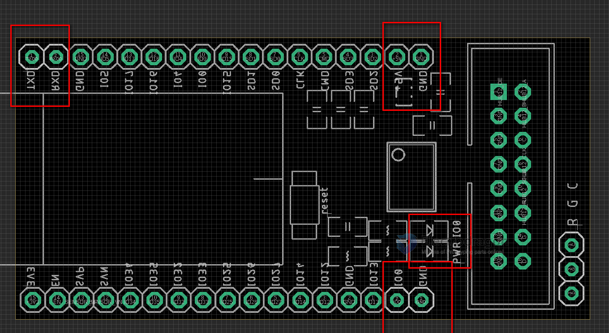

# IDD1023-dat 

## Board Map 

## Wiring

* You will need a [[USB-TTL-dat]] adapter bridge board or cable, to interface or program ESP32 via the serial interface

To communicate with ESP32 normally, connect (working mode):
* TXD->RXD, RXD->TXD, +5V=+5V, GND=GND
* remove IO0-GND jumper, IO0 LED should be off

To program ESP32 (flashing mode):
* Connect the same serial interface
* Put **IO0-GND jumper ON**, IO0 LED should be ON
* press reset button to enter into flash mode
* Upload arduino demo code

## Code 

- original library DMD32 - https://github.com/Qudor-Engineer/DMD32
- the code has not maintained for a long while, please use old version of arduino ESP32, please refer to the video below
- https://github.com/Edragon/Arduino-ESP32
- please use the standard code in folder - Arduino-ESP32/libraries
/DMD32-main/

## Demo Early Test 

use guide - https://www.youtube.com/shorts/mtdM9uB3fyo

correct test: https://twitter.com/electro_phoenix/status/1434776186354241536

test in error: https://twitter.com/electro_phoenix/status/1427971402561327106

## demo video 

- https://t.me/electrodragon3/187
- https://t.me/electrodragon3/196

## ref 

- [[RMP-driver-dat]]

- [[IDD1023]]

- [[ESP-SDK-dat]]