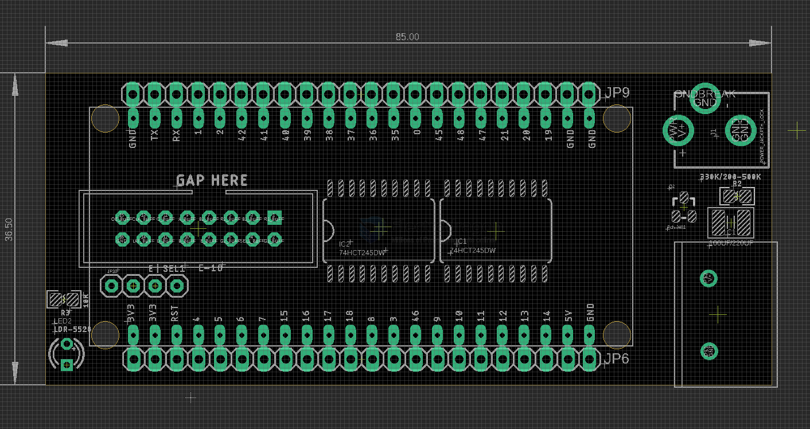
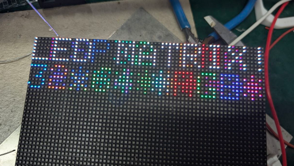

# IDD1027-dat

- [[ESP32-S3-dat]] - [[IDD1013-dat]] - [[IDD1027-dat]] - [[led-rgb-panel-dat]]

suitable boards - [[ESP32-S3-board-VCC-dat]] - [[ESP32-S3-board-WV-dat]] - [[ESP32-S3-board-dat]] 

- [[protection-power-dat]]

- [[IDD1013-dat]] - [[HUB75-dat]]

- [[led-rgb-panel-dat]]

## board map 

## default pin for ESP32-S3 

https://github.com/mrfaptastic/ESP32-HUB75-MatrixPanel-I2S-DMA

#include <ESP32-HUB75-MatrixPanel-I2S-DMA.h>

https://github.com/mrcodetastic/ESP32-HUB75-MatrixPanel-DMA/blob/master/src/platforms/esp32s3/esp32s3-default-pins.hpp

libraries\ESP32_HUB75_LED_MATRIX_PANEL_DMA_Display\esp32s3-default-pins.hpp

#define R1_PIN_DEFAULT 4
#define G1_PIN_DEFAULT 5
#define B1_PIN_DEFAULT 6
#define R2_PIN_DEFAULT 7
#define G2_PIN_DEFAULT 15
#define B2_PIN_DEFAULT 16
#define A_PIN_DEFAULT  18
#define B_PIN_DEFAULT  8
#define C_PIN_DEFAULT  3
#define D_PIN_DEFAULT  42
#define E_PIN_DEFAULT  -1 // required for 1/32 scan panels, like 64x64. Any available pin would do, i.e. IO32
#define LAT_PIN_DEFAULT 40
#define OE_PIN_DEFAULT  2
#define CLK_PIN_DEFAULT 41

## 64x64 test 

test chip DP5125 / MV245B

## ref 

