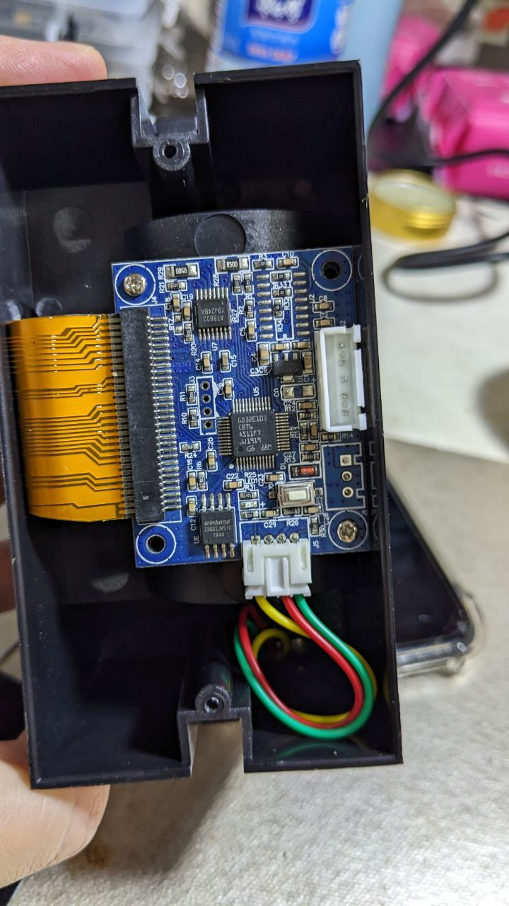
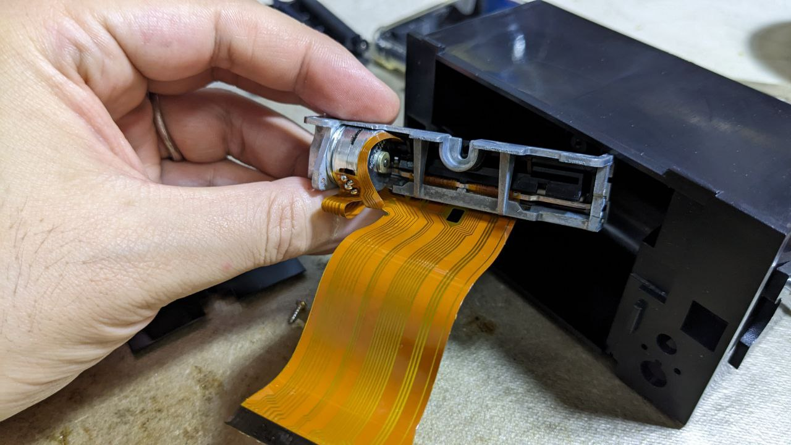
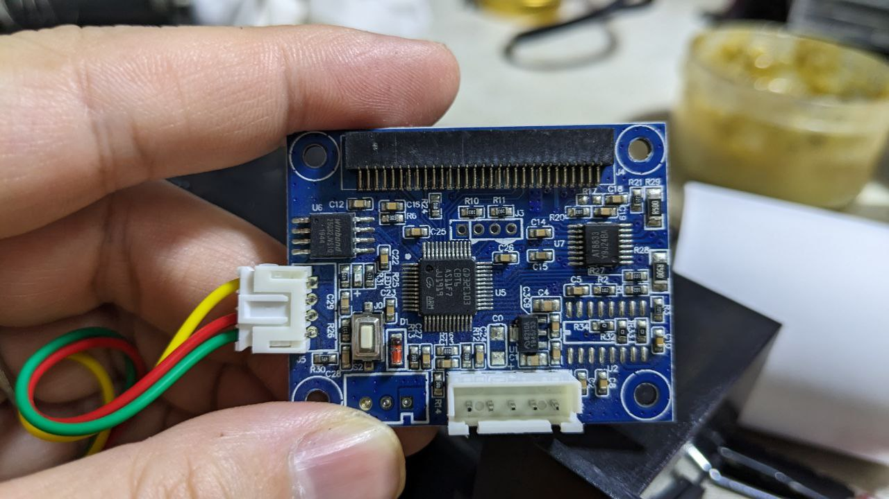

# IDO1007-dat

https://www.electrodragon.com/product/mini-thermal-receipt-printer-serial-5v/

## Note 

- 5V 2A or 9V 1A, up to 10W is requireted to print
- there is a small stepper motor inside to print

## ref demo code 

- https://github.com/adafruit/Adafruit-Thermal-Printer-Library
- https://learn.adafruit.com/mini-thermal-receipt-printer

- adafruit thermal printer library

- print to send demo code: https://raw.githubusercontent.com/sparkfun/Thermal_Printer/master/Firmware/ThermalPrinter_Example.ino

- [[thermal-printer-dat]] 

- [[IDO1005-dat]] - [[IDO1006-dat]]
  
- [[ido1005]] 

## demo 

- [demo video 2024](https://www.youtube.com/watch?v=Ar9Doc7Herk&ab_channel=Electrodragon)
- https://www.youtube.com/watch?v=OtiqfW70x2Q

## Inside 

## log - obseleted 

Type:
- Type-R1 supports well arduino R1 library, specially the bitmap, AD version
- Type-R1 is 5p xh2.54
- Type-R2 does not well support bitmap library, probably need hack work, but can work with R2 library. SF version.
- Type-R2 is 2 group of 3p xh2.54

## ref 

- [[IDO1005-dat]]

- [[IDO1007]]