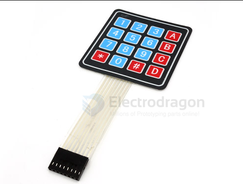

# IKE1011-dat

## Info

[product url - Membrane Button Keypad [Types]](https://www.electrodragon.com/product/4x4-matrix-16-key-membrane-switch-keypad-keyboard-new-for-arduinoavrpicarm/)

The 4x4 Keypad is a general purpose 16 button (4x4) matrix keypad. It comes ready to work, simply peel-off the adhesive backing, stick it to your surface 

### Board Map, Dimension, Pins, chip info, Use Guide, Setup Jumper, etc.

## Applications, category, tags, etc. 

- [[keypad-dat]]

## Demo Code and Video

## ref 

- [[membrane-keyboard-dat]]

- [[IKE1007-dat]] - [[IKE1009-dat]] - [[IKE1011-dat]] - [[IKE1013-dat]] 

- [[IKE1011]] 

- [legacy wiki page ](https://www.electrodragon.com/w/index.php?title=Membrane_Switch_Keypad)

