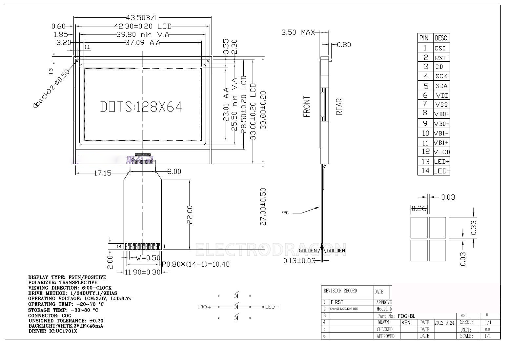

# ILC1008-dat

https://www.electrodragon.com/product/12864min-graphic-lcd/
12864MIN Graphic LCD - withoutPCB

legacy wiki page - https://www.electrodragon.com/w/12864min_LCD

- [[ILC1007-dat]]

## specs 
- Product name LCD module
- Model 12864G
- Appearance (L*W*H) 43.5*33.0*3.5
- Viewing area (L*W) 39.8*25.5
- Point (L*W)mm 0.26*0.33
- Point (L*W)MM 0.29*0.36
- IC model UC1701X
- 5V/3.3V 3.3V
- PCB board FPC interface, no PCB
- Parallel/Serial Serial

## ref 

- [[ILC1008]]