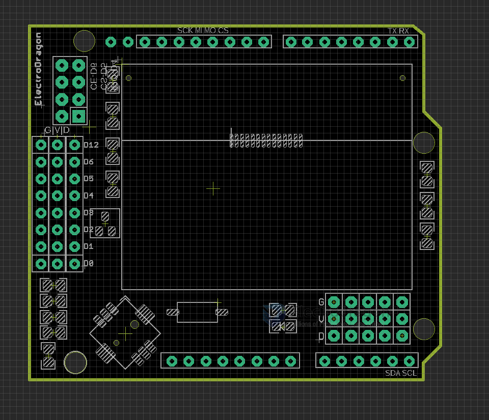

# ILC1016-dat

legacy wiki page - https://www.electrodragon.com/w/LCD12864_Shield

- [[ILC1008-dat]]

## Pin Definitions 

LCD 

- SCK - D13 
- MISO - D12
- MOSI - D11
- CS - D10 
- CD - D9
- RST - D8 

NRF24

- NRF24_IRQ - D4
- NRF_CS - D5 
- NRF_CE - D6 

## demo video 

- https://www.youtube.com/watch?v=Y37IkFVPCnM

## ref 

- [[NRF24L01-dat]] - [[joystick-dat]] - [[LCD-12864-dat]]