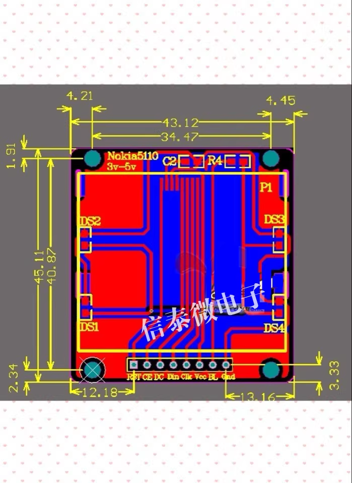

# ILC1020-dat

## Info

[product url - Nokia 5110 Graphic LCD 80×48, PCD8544](https://www.electrodragon.com/product/nokia-5110-lcd-pcd8544-driver-chip/)

- [legacy wiki page ](https://w.electrodragon.com/w/5110_Display)

### Board Map, Dimension, Pins, chip info, Use Guide, Setup Jumper, etc.

dimension 

- [[PCD8544-dat]]

The 5110 LCD is a second-hand screen removed from mobile phones. All LCDs sold on this site are carefully selected for excellent appearance and quality.

There are positioning holes at the four corners, and two rows of connection terminals are provided at the top and bottom, arranged as follows:

- RST — Reset
- CE — Chip Enable
- DC — Data/Command Selection
- DIN — Serial Data Line
- CLK — Serial Clock Line
- VCC — Power Input (both 3.3V and 5V are supported, verified by experiments)
- BL — Backlight Control
- GND — Ground

The interface is a serial SPI interface. This site provides driver routines for 51 microcontrollers and Nios II soft cores!

## Applications, category, tags, etc. 

## Demo Code and Video

## ref 

- [[ILC1020]] 

- [legacy wiki page ](https://w.electrodragon.com/w/5110_Display)

