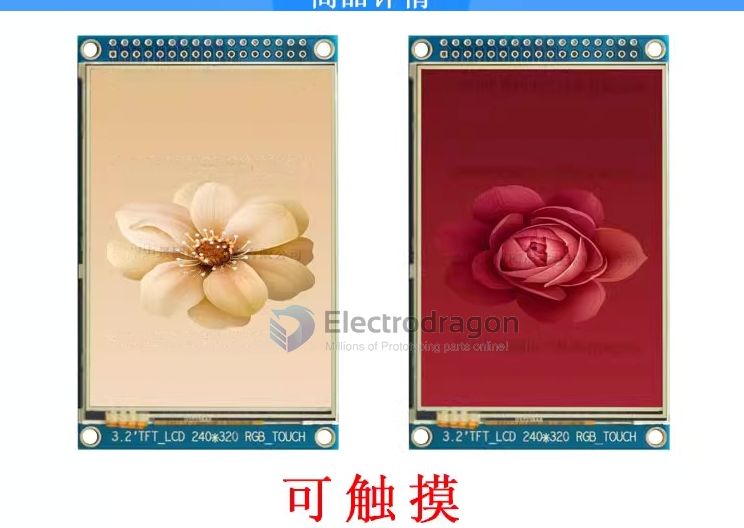
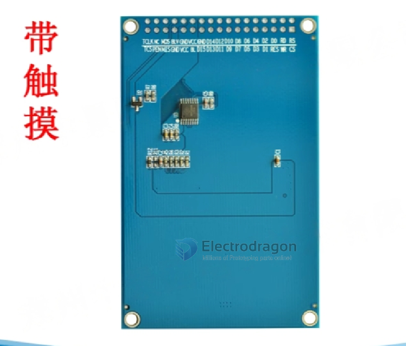

# ILC1028-dat

## specs

| Specs               | Params                                      |
| ------------------- | ------------------------------------------- |
| Dimensions          | 3.2 inches                                  |
| Material            | TFTLCD                                      |
| Resolution          | 240×RGBx320 (electrodragon note1 )          |
| Control chip        | IL9341 and ST7789 two drivers are available |
| Display area        | 48.60(w)\*64.80(H)mm                        |
| Overall dimensions: | 56 (w) _ 89.4 (H) _ 3.6 (T) mm              |
| Interface type      | 16-bit parallel port                        |
| Backlight type      | LED\*6                                      |
| Voltage             | 2.8V~3.3V                                   |
| Current             | 90ma                                        |
| Power consumption   | 0.32W                                       |
| Working temperature | -20~70 degrees                              |
| Viewing direction   | 120 o'clock                                 |
| Touch type          | with touch                                  |
| Number of pins:     | 34PlN (2.54mm pitch double row pin header)  |
| Working temperature | -20~70 degrees                              |

- note 1: The display direction can be adjusted, both horizontal and vertical screens can be used

## ref

- [[ILC1028]] - [[EDL-LCD]]
