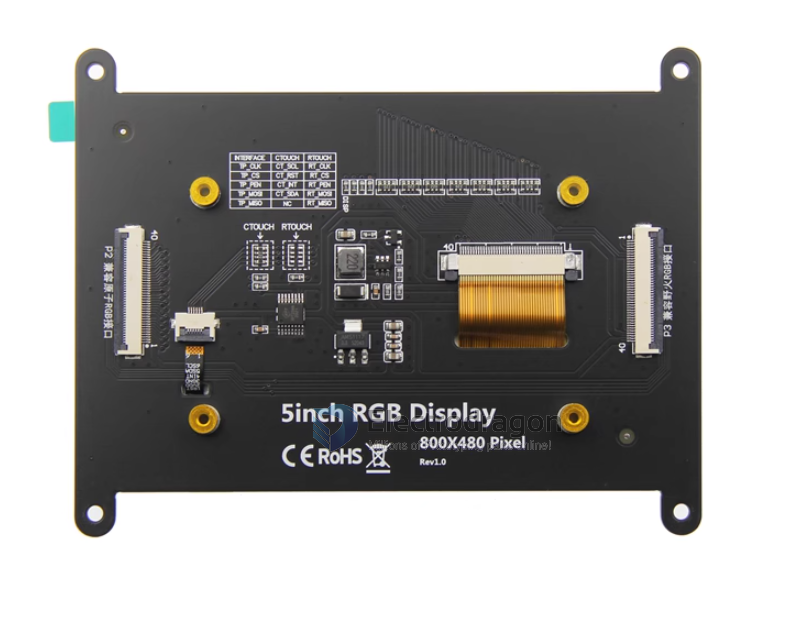
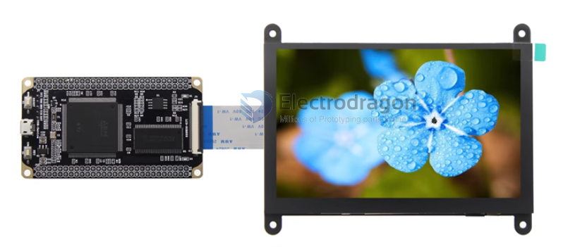
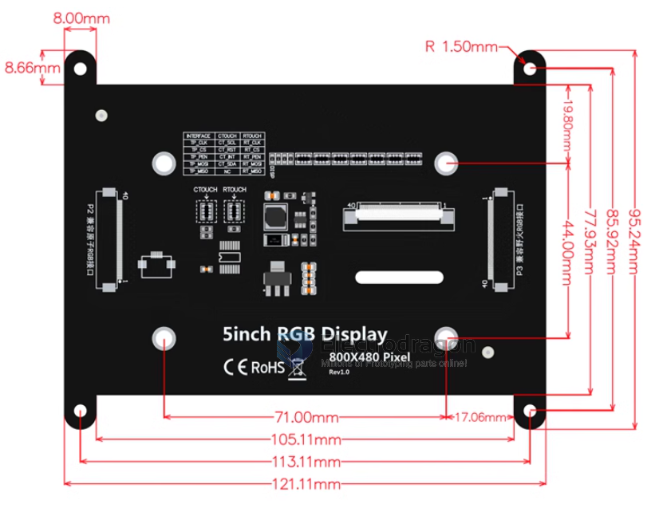

# ILC1031-2-dat 

- FPC cable connection 
- RGB parallel interface = RGB 888 
- 24-bit RGB parallel port
- RGB888 16.7M (compatible with RGB565 65K) color
- 800 x 480
- Effective display area (AA area) 108.00x64.80 (mm)
- Module PCB backplane size 121.11x95.24(mm)
- control chip = None 

- [[ILC1031-2]] - [[ILC1031]] - [[display]]

