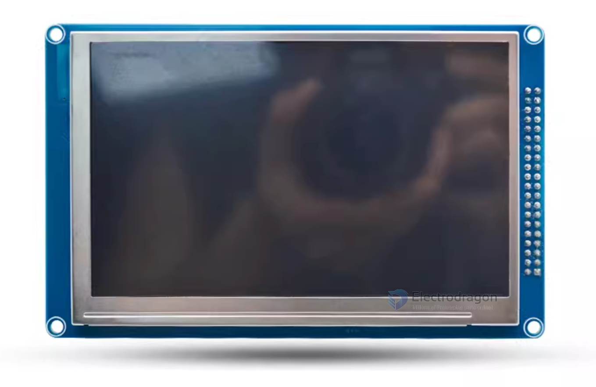
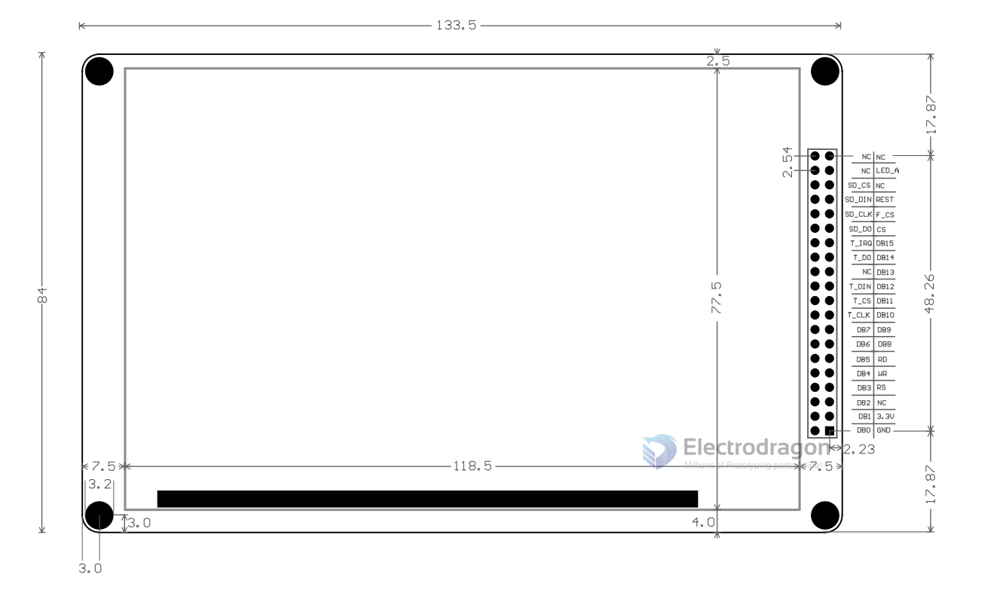

# ILC1031-dat 

5" LCD 

https://www.electrodragon.com/product/tft01-lcd-tft-display-3-2-65kcolors-320240-resolution-touch-panel-sd-slot/

main series - [[EDL-LCD-dat]] 

## appearnace 

## Dimension 

## Pin Map 

- The pins starting with T_ are touch control pins,
- The pins starting with SD_ are SD card control pins,
- The pins starting with F_ are flash control pins.
- The others are TFT control pins,
- The flash chip is reserved and not soldered on the board. If the buyer needs it, please solder the SPI interface FLASH chip by yourself.

## Testing C8051 

Code test environment: JME-2 core board + STC microcontroller with 1T instruction cycle (51 core STC12LE5A60S2) + 33M crystal oscillator

Microcontroller operating voltage 3.3V

Program default IO connection method:

Control line:

    - RS-P3^5;
    - WR-P3^6;
    - RD-P3^7;
    - CS-P1^0;
    - REST-P1^2;

Data line:

    - DB0-DB7 connects P0^0-P0^7 in sequence;
    - DB8-DB15 connects P2^0-P2^7 in sequence;

Touch function connection method: (not connected if touch is not used)

    - D_CLK-P1^7;
    - D_CS-P1^4;
    - D_DIN-P3^0;
    - D_OUT-P3^1;
    - D_PENIRQ-P3^4;

## Code 

## ref 

- [[EDL-LCD-dat]]

- [[ilc1031]] - [[EDL-LCD]]

- [[SSD1963-dat]]

alternative version - [[ILC1031-2-dat]]

- [[MD050SD-dat]]

