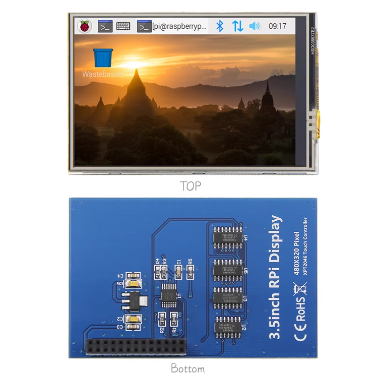
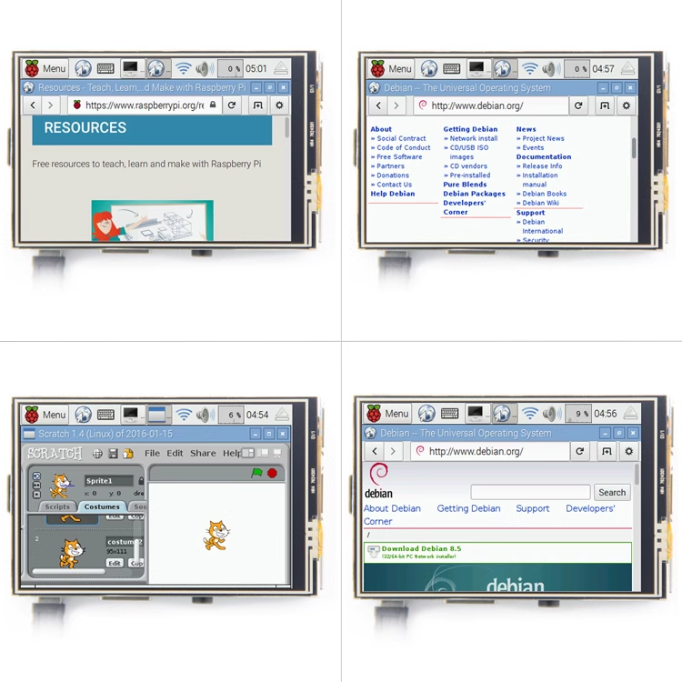
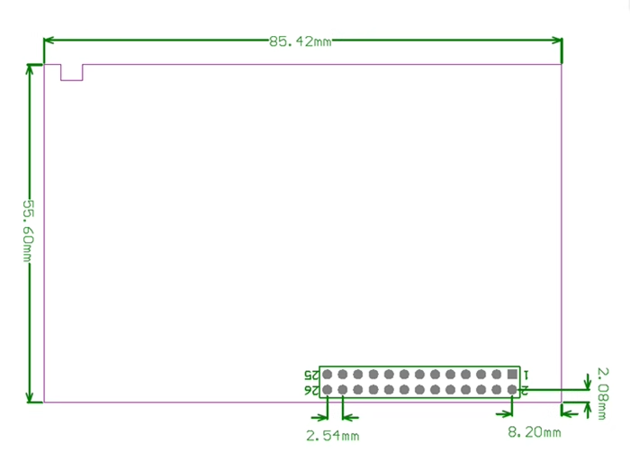

# ILC1041 dat

https://www.electrodragon.com/product/raspberry-pi-5-hdmi-lcd-display-wtouch/

## The appearance 

## ref 

- [[ILC1041]]
- please find driver in our git repository 
- size lcd and version compare [[RPI-LCD-dat]]

## Installation Methods: 

This product supports custom installation of Raspbian and Ubuntu images. It only takes two simple steps to install the complete driver:

### Step 1 - Install Raspbian official image

1) Download the latest Raspbian image from the official Raspbian Pi

2) Use SDFormatter to format the TF card,

3) Use Win32DiskImager to burn the official image to the TF card.

### Step 2 - Install LCD driver

There are two methods:

#### Method 1 (suitable for offline installation):

1. Copy the LCD-show.tar.gz driver to the root directory of the Raspberry Pi system (it is recommended to copy the driver directly to the TF card after step 1 is completed, or copy remotely using SFTP or other methods)

2. Log in to the Raspberry Pi system and go to the user command line (initial username: pi, password: raspberry), and execute the following commands:

commands: 

    cd /boot
    sudo tar zxvf LCD-show.tar.gz
    cd LCD-show/
    sudo ./LCD35-show

#### Method 2 (suitable for online installation):

1. SSH into the Raspberry Pi system to the user command line interface (initial username: pi password: raspberry)

2. Obtain the latest driver from GitHub and install it (Raspberry Pi needs to be connected to the Internet): (Replace * in the above code with h)

commands: 

    sudo rm -rf LCD-show
    git clone *ttps://github.com/goodtft/LCD-show.git
    chmod -R 755 LCD-show
    cd LCD-show/
    sudo ./LCD35-show

### 3) After executing the above command and waiting for a while, you can use the corresponding Raspberry PiLCD.

