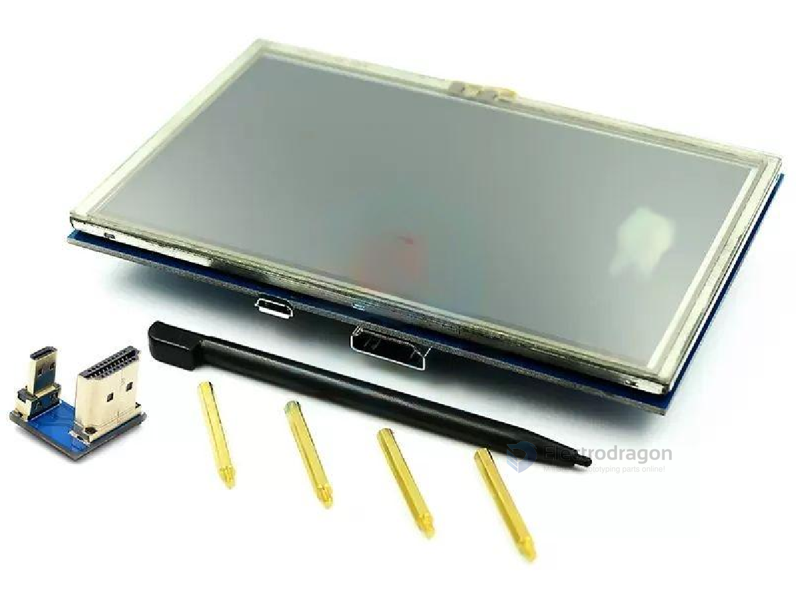
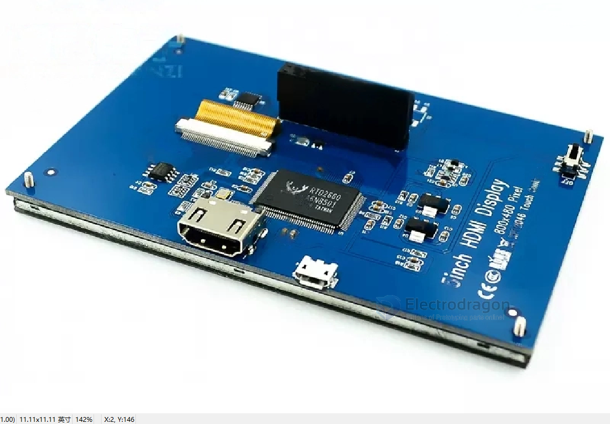
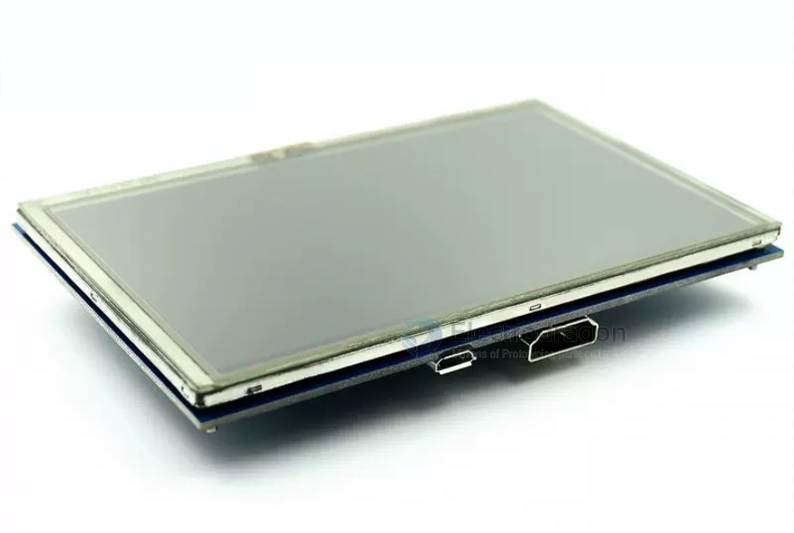

# ILC1042-dat 

- [legacy wiki page here.](https://w.electrodragon.com/w/RPI_Display#5_inch_HDMI_+_Touch_LCD)

## Specs: 

Main:
- with touchscreen xpt2046 chip
- The 5-inch is an HDMI interface input and does not require a driver.
- 800x480
  
All Specs:
- 5-inch standard display, 800×480 HD resolution
- With resistive touch screen, supports touch control
- Supports independent backlight control and can turn off the backlight to save power consumption
- Supports standard HDMI interface input, compatible and can be directly plugged into Raspberry Pi (3rd generation, 2nd generation and 1st generation)
- Can be used as a general HDMI display, such as connecting to a computer HDMI as a secondary display (the resolution output must be adjustable to 800X480)
- If it is only used for display, there is no need to occupy IO resources (Rasperry Pi does not need to occupy IO resources when using the touch function)
- Size: 5.0(inch)
- SKU: ILC1042
- Resolution: 800×480(dots)
- Touch: 4-wire resistive touch
- Overall dimensions: 121.11*77.93(mm)
- Product weight: 175(g)

## Images: 

## Note !! 

- This display default version includes HDMI mini convert board for **raspberry PI 3**, if need for **RPI4**, please **add order note**!!

## demo 

https://www.youtube.com/watch?v=fp2zlpffT48&ab_channel=ChowHe

## Drivers and OS note 

- No need custom Raspbian OS image, it is not necessary for new version of raspbian.
- Only provide support for the latest version of RPI, please update if necessary.
- No need driver for HDMI (but need config resolution), need driver setup for touch screen

## ref 

- size lcd and version compare [[RPI-LCD-dat]]

- [[ILC1042]]