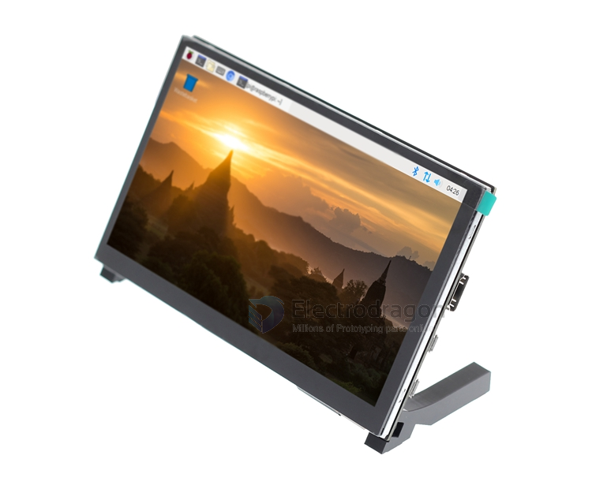
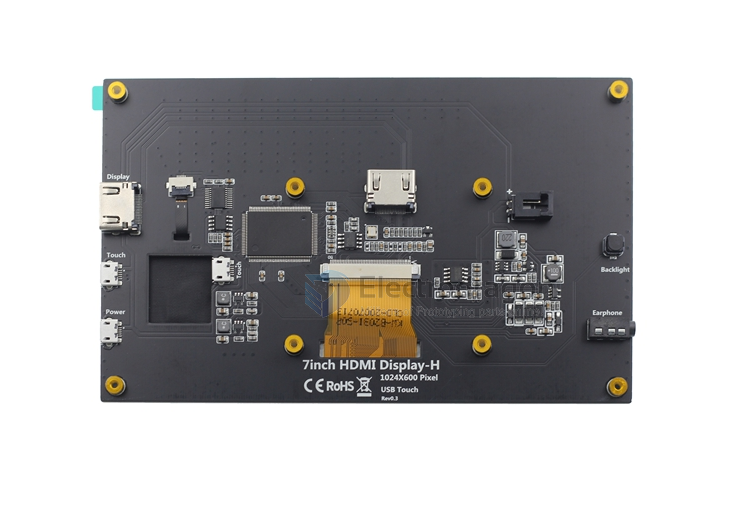

# ILC1043-dat

## current version HS

### Features:

IPS full viewing angle display
- ○Wide viewing angle
- ○Real colors
- ○Excellent dynamic image quality
- ○Energy saving and environmental protection

1024X600 HD vision
- ○The resolution is HD 1024X600 dot matrix
- ○More delicate than 800X480 ordinary display screen

External audio output interface
- ○Built-in power amplifier circuit
- ○External 3.5mm audio output interface

Use as mini PC monitor
- ○Supports mainstream development boards such as Raspberry Pi, Banana Pi, and BB Black
- ○When used with Raspberry Pi, it supports mainstream systems such as Raspbian, Kali linux, and ubuntu, and is single-touch plug-and-play and driver-free.
  
Use as computer monitor
- ○Support win10/win8/win7 system, support five-point touch, plug and play without driver

## ref 

- size lcd and version compare [[RPI-LCD-dat]]

- [[ILC1043]]

## Obseleted Part

### Important Note
* Follow the attached image of instruction to build it.
* '''Only tested on raspbian, ubuntu, other systems can not bu sure. Please try it by yourself.'''
* [Original HDMI has a hard stiffness, you can replace it with this one.](http://www.electrodragon.com/product/hdmi-hdmi-cable/)
* Original usb cable is a little too long.
* After driver is installed, you will only need to power RPI, the LCD can touch panel can draw power from RP
* Fragile stand kit, do no apply too large force on it, otherwise will breakdown!
* No need calibrate for touch screen

### Specification 
* LCD type: AT070TN90
  
### Installation
* please use the latest raspbian image 20150605.
* please find the download link in your order note to download the driver.
* copy RPI2B_B_B+_USB_TOUCH_CAP_7.0_RASPBIAN.tar.gz to RPI
* unzip it
 sudo tar  zxvf  RPI2B_B_B+_USB_TOUCH_CAP_7.0_RASPBIAN.tar.gz
* cd into the folder
* and run to install
 sudo  ./USB_TOUCH_CAP_7.0_RASPBIAN
* enter into graphic deskttop to use

### setup touch 

commands:

    sudo tar zxvf touch.tar.gz
    cd RPIB_B+_USB_TOUCH_CAP_7.0_RASPBIAN_20150605
    sudo ./USB_TOUCH_CAP_7.0_RASPBIAN

### Virtual Keyboard

commands:

    apt-get install matchbox-keyboard
    apt-get install florence

### Note
* after install the driver, you can draw the power from RPI to the LCD
