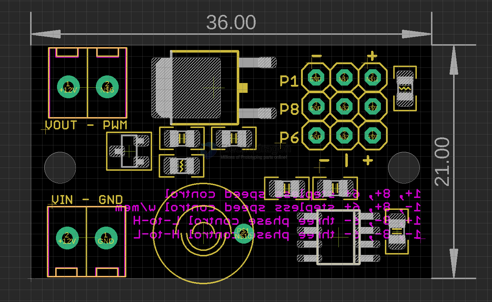
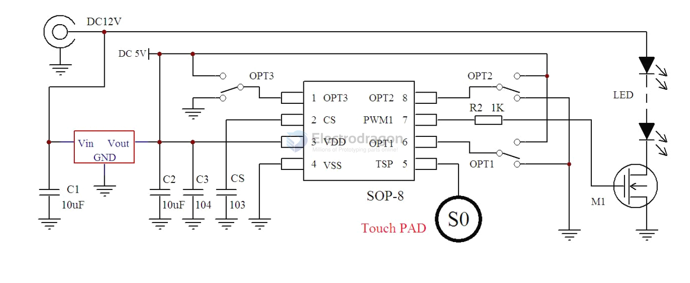

# ILC1063-dat

[light-tuner-controller-sjt83-breakout](https://www.electrodragon.com/product/light-tuner-controller-sjt83-breakout/)

## board map 

## control 

Use a special light tuning IC SJT83, supports two ways of controlling:
- press once to turn ON, hold for speedless tuning light from low to high, press once to turn off
- press once to turn ON, hold for speedless tuning light from high to low, press once to turn off
- press once to turn ON, press each three times for low, medium, high light intensity, press once to turn off
- press once to turn ON, press each three times for low, medium, high light intensity, press once to turn off

Chip function simply based on mosfet output control, it is a pre-programmed chip.

| pin 1 | pin 8 | pin 6 | function                     |                                                                                         |
| ----- | ----- | ----- | ---------------------------- | --------------------------------------------------------------------------------------- |
| +     | +     | +     | stepless speed control       | Sudden change, single-button single-output stepless dimming without brightness memory   |
| -     | +     | +     | stepless speed control w/mem | Sudden change, single-button single-output stepless dimming with brightness memory      |
| +     | -     | -     | three phase control L-to-H   | LED three-stage dimming, sequence: low brightness-medium brightness-high brightness-OFF |
| -     | -     | -     | three phase control H-to-L   | LED three-stage dimming, sequence: high brightness-medium brightness-low brightness-OFF |

## SCH 

## demo video 

- https://www.youtube.com/watch?v=2B5snq0Ek3s
- speedless control, note the LED has a lens on it

## ref 

- [[SJT83-dat]] 

- [[ILC1063]]

- [[led-driver-dat]]