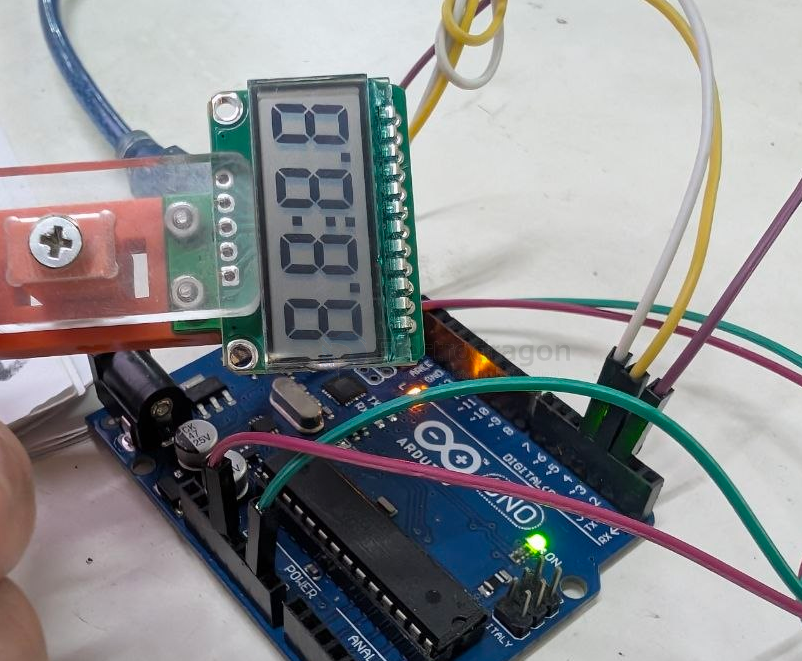

# ILC1067-dat

refer to [[ILC1066-dat]]

- [[HT1621-dat]] - [[ILC1067-dat]] - [[ILC1066-dat]] - [[segment-lcd-dat]] - [[holtek-dat]]

## Info

[product url - 4 Digits Segment LCD Display, uA Low Power [Version]](https://www.electrodragon.com/product/2pcs-segment-lcd-4-digit/)

### Board Map, Dimension, Pins, chip info, Use Guide, Setup Jumper, etc.

## Applications, category, tags, etc. 

## Demo Code and Video

working library - https://github.com/valerionew/ht1621-7-seg

## ref 

- [[ILC1067]] 

- legacy wiki page 

## ref 

