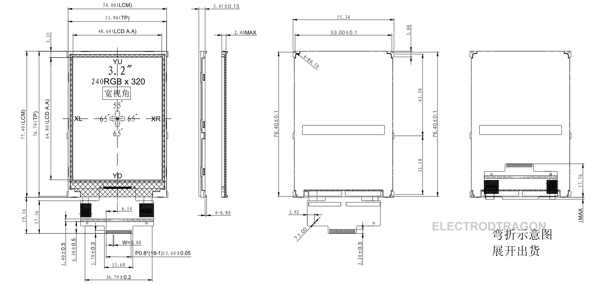

# ILC1078 dat 

## 3.2''LCD pin definitions: 
* 1 GND
* 2 RESET
* 3 SCL
* 4 D/C
* 5 CS
* 6 SDA 
* 7 SDO 
* 8 GND
* 9 VCC
* 10 LEDA
* 11 LEDK
* 12 LEDK
* 13 LEDK
* 14 LEDK
* 15 XL
* 16 YU
* 17 XR
* 18 YD

## dimension 

