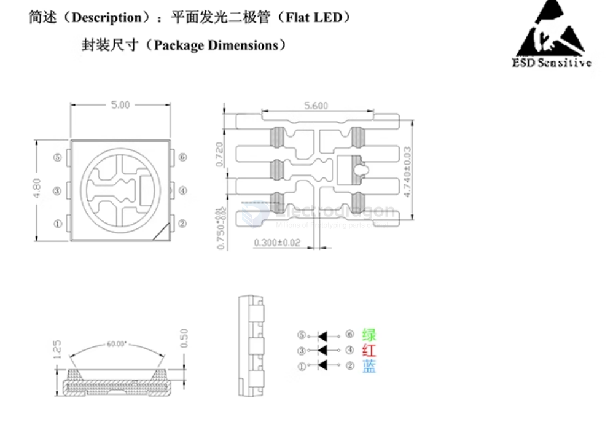
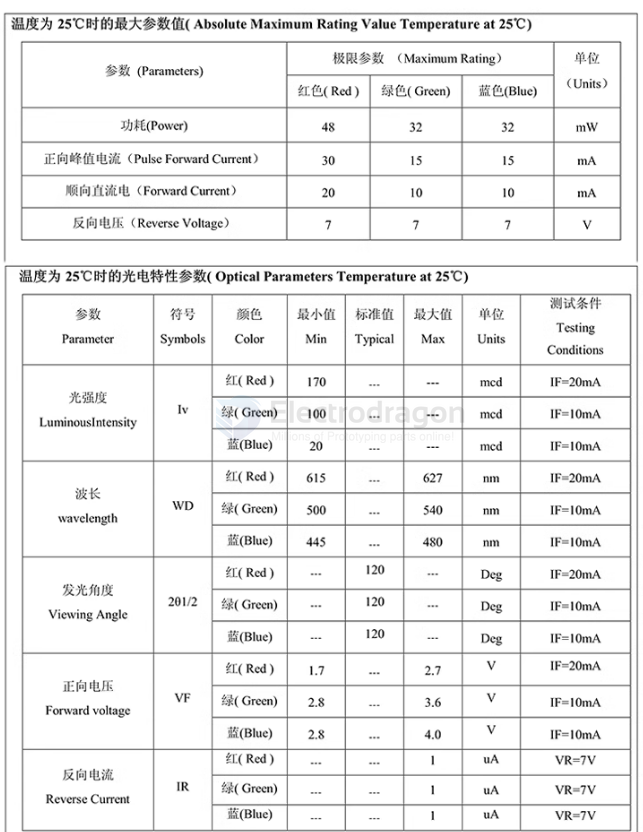
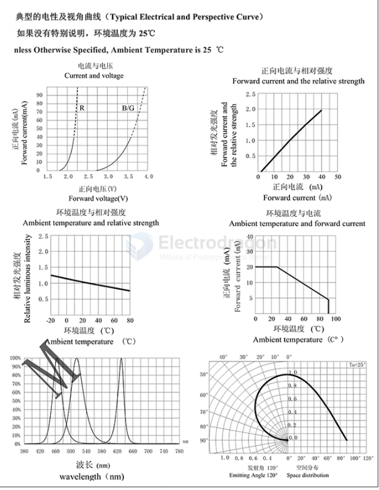
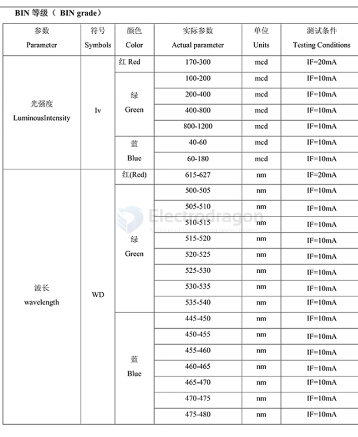
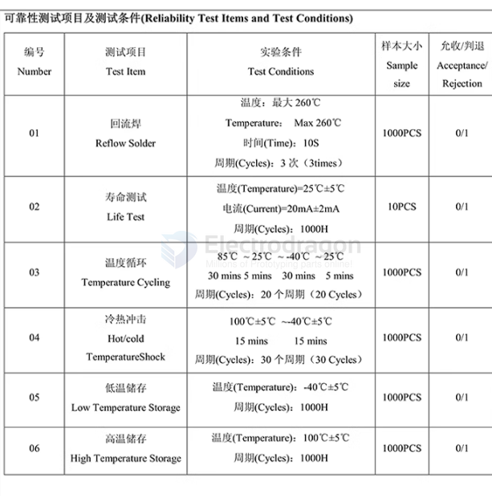
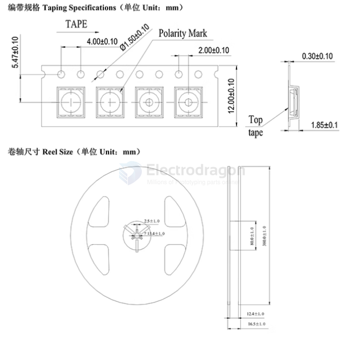

# ILE1002-dat

## Info

[product url - 10PCs SMD5050 RGB LED](https://www.electrodragon.com/product/smd5050-rgb-led-10pcs/)

### Board Map, Dimension, Pins, chip info, Use Guide, Setup Jumper, etc.

Working voltage:
- R 1.9 – 2.1 V
- G 3.0 -3.2V
- B 3.0 – 3.2V

Working current: 52-55 mA

Product lightness:
- R 400-500
- G 1000-1200
- B 300-400 (MCD)

Product wavelength:
- R 620-625
- G 520-525
- B 465 – 470

Working angle:130-140 degree

Notice: solder temperature should not higher than 260 degree

Pin 1, 2, 3 on > side is GND, and pin 4, 5, 6 is RGB VCC in.

## Applications, category, tags, etc. 

## Demo Code and Video

* The eagle library file is here for downloading. - [[RGB-LED-Library-eagle.zip]]

## ref 

- [[ILE1002]] 

- legacy wiki page 
