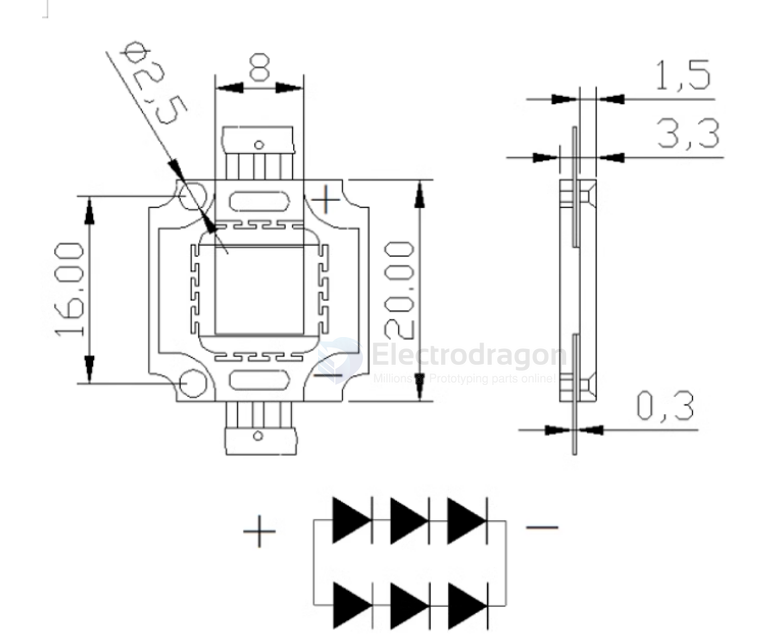

# ILE1039-dat

## Info

[product url - High-Light Full-White 10W Power LED](https://www.electrodragon.com/product/high-light-full-white-10w-power-led/)

### Board Map, Dimension, Pins, chip info, Use Guide, Setup Jumper, etc.

specs 

dimensions 

## Applications, category, tags, etc. 

## Demo Code and Video

- [[SDR1073-dat]] + [[ILE1039-dat]] == [Electric tools battery + 10W high power led #ILE1039 + Arduino + MOSFET control #SDR1073, resistor 3W will smoke after 2 minutes at 51R, 0.75A, 20V](https://t.me/electrodragon3/377)

## ref 

- [[ILE1039]] 

- [legacy wiki page ](https://www.electrodragon.com/w/High_Power_Full-White_LED#Specification)

