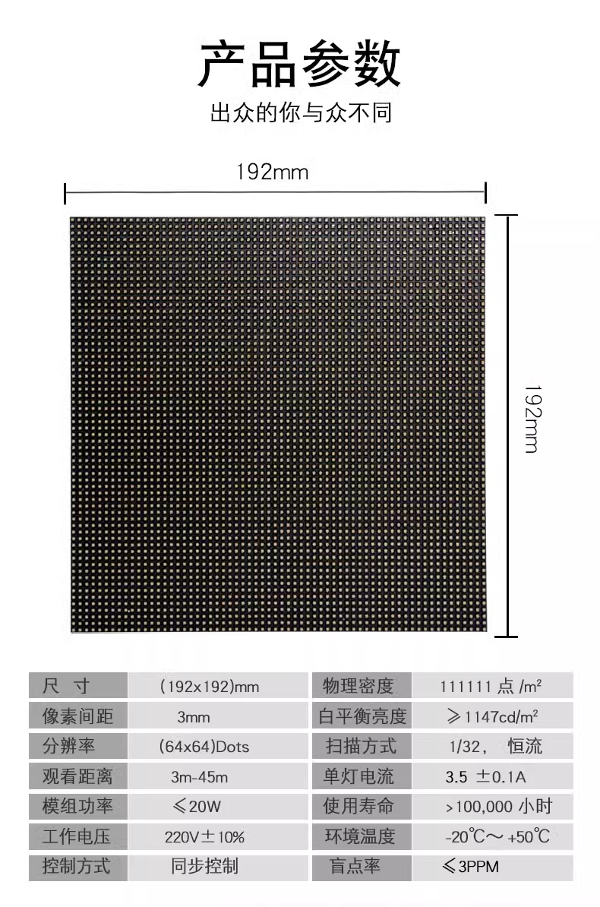

# ILE1060 DAT

## specs 

### P3
- normally indoor use 
- 64x64 LED x LED pixels 
- to size is 192 x 192 mm

## ref 

- [[ILE1060]]

- [[ILE1058-dat]] - [[ILE1059-dat]] - [[ILE1060-dat]] - [[led-rgb-panel-dat]]