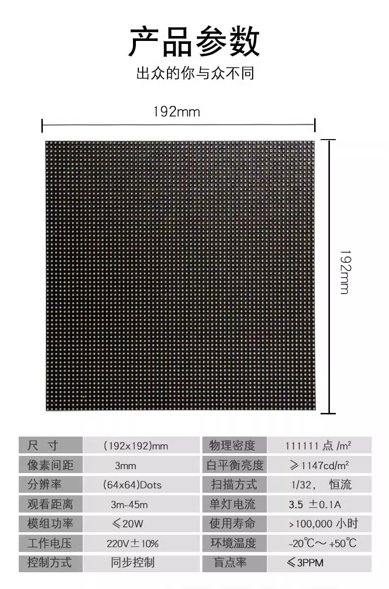
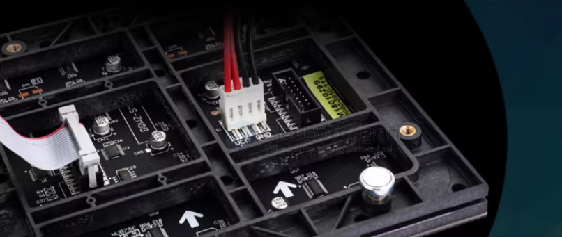
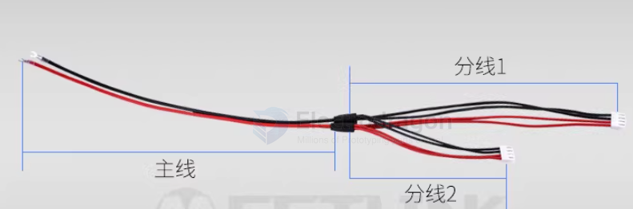

# ILE1060 DAT

## specs 

### P3
- normally indoor use 
- 64x64 LED x LED pixels 
- to size is 192 x 192 mm

## packages 

- main display - [[ILE1060-dat]]

- [[cable-ribbon-dat]] - [[HUB75-dat]] == 26P

- [[cable-power-dat]] - [[conn-cable-terminal-dat]] - [[CONN-VH3.96-dat]] - [[conn-cable-terminal-crimp-dat]]

- [[screw-dat]] - [[screw-magnetic-dat]]

- [[waterproof-dat]]

## version logs - ignore for hack only 

- P3匹配通用板
- P3-RGB-32S-6464-V2.2
- P3-M3
- P3-32S-HL1.4/1.2
- KSL-3-6464-V2.0
- Q3F32V4.1(16237+2013)
- Q3F32V4(16207+2013)
- HUB30接口(2053+2012)
- Q3F32V4.1(2053+2012)
- Q3F32V4.1(2055+5266)

## ref 

- [[ILE1060]]

- [[ILE1058-dat]] - [[ILE1059-dat]] - [[ILE1060-dat]] - [[led-rgb-panel-dat]]